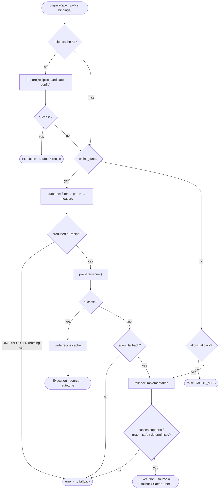

# cuda-new Design

> Architecture notes for `crates/apxinf-cuda-new`.
> Public API listing: `doc/cuda-new-api.md`;
> English contract: `crates/apxinf-cuda-new/README.md`; tunable operator catalog: `cuda-operator.md`.

Contents:

1. Layering (§1)
2. Tunable operators (§2)
3. Fixed operators (§3)
4. Autotune and fallback (§4: Recipe vs Execution / selection–tuning–fallback decision graph / policy)
5. Graph capture and sessions (§5: why graphs / thread-local flags / session / two passes / PreparedPhase / cross-position reuse)
6. Naming conventions (§6)

---

## 1. Layering: L3 → L0

```text
L3  Semantic layer (Rust)   src/ops/<op>.rs             defines WHAT to compute
L2  Execution layer (Rust)  src/ops/<family>/contracts.rs,   validation, normalization, cache keys
                            src/ops/<family>/*execution*.rs
────────────── C ABI (src/ffi/abi/*.rs ↔ native/include/apxinf_cuda/*.h) ──────────────
L1  Native operator (C++)   native/adapters/<family>/   selection, tuning, fallback
L0  Kernel layer (CUDA)     native/kernels/             device-side computation
```

### The L3 interface exposed to the model layer

`src/ops/gemm/contracts.rs`, `src/ops/attention/contracts.rs`:

```rust
pub struct GemmArgs<'a> {
    pub a: &'a Tensor,
    pub b: &'a Tensor,
    pub out: &'a mut Tensor,              // canonical row-major [M, N]
    pub quantization: GemmQuantization<'a>,
    pub alpha: f32,
    pub output_scale: f32,
    pub policy: GemmPolicy,
}
pub fn gemm(ctx: &CudaContext, args: GemmArgs<'_>) -> Result<()>

pub struct AttentionArgs<'a> {
    pub query: &'a Tensor,
    pub key: &'a Tensor,
    pub value: &'a Tensor,
    pub out: &'a mut Tensor,
    pub mask: AttentionMask,              // None / Causal
    pub scale: f32,
    pub output_scale: f32,
    pub policy: AttentionPolicy,
}
pub fn attention(ctx: &CudaContext, args: AttentionArgs<'_>) -> Result<()>
```

The L3 interface only describes *what* to compute: the parameters are tensors, a mask,
scaling factors, and a policy. No backend library name (cuBLAS / CUTLASS / FA2) appears
in the signature. The policy expresses constraints only — whether on-line tuning is
allowed, whether graph capture must be possible, whether bitwise reproducibility is
required — never which implementation to use; that choice belongs to L1. `GemmPolicy`
and `AttentionPolicy` share the same fields; defaults are in §4.3.

### L3 → L2

One line each; normalize, then enter the execution layer:

```rust
// src/ops/gemm/gemm.rs
pub fn gemm(ctx: &CudaContext, args: GemmArgs<'_>) -> Result<()> {
    execution::execute(ctx, normalize(ctx, args, Semantic::Gemm, None)?)
}

// src/ops/attention/attention.rs
pub fn attention(ctx: &CudaContext, args: AttentionArgs<'_>) -> Result<()> {
    execution::execute(ctx, normalize(ctx, args)?)
}
```

The L2 of both families follows the same flow, just in different files: compute an
`ExecutionKey` from the normalized result, look it up in the per-process session cache
(`lookup_execution`); on a hit reuse the prepared handle, on a miss build a new one and
store it back (`store_execution`). GEMM lives in `gemm_execution.rs`, Attention in
`attention/execution.rs`.

### L2 → L1: the C ABI

Each tunable operator family exposes exactly one prepare/enqueue/destroy triple; the
semantics within a family are distinguished by the Spec's `semantic` field rather than
by separate interfaces. Responsibilities:

- `prepare`: outside capture, performs selection, tuning, and resource allocation, and
  returns an opaque handle (`execution`). The handle is bound to the current addresses
  and stream and can be enqueued repeatedly.
- `enqueue`: only submits already-prepared work to the stream; never selects, allocates,
  or synchronizes. During capture this is the only call allowed.
- `destroy`: releases the provider state and resources owned by the handle.

All parameters are plain data (runtime / spec / policy / bindings); the handle itself is
opaque to Rust:

```rust
// src/ffi/abi/gemm.rs ↔ native/include/apxinf_cuda/gemm.h
fn apxinf_gemm_prepare(runtime, spec, policy, bindings, execution) -> i32;
fn apxinf_gemm_enqueue(execution) -> i32;
fn apxinf_gemm_destroy(execution);

// src/ffi/abi/attention.rs ↔ native/include/apxinf_cuda/attention.h
fn apxinf_attention_prepare(runtime, spec, policy, bindings, execution) -> i32;
fn apxinf_attention_enqueue(execution) -> i32;
fn apxinf_attention_destroy(execution);
```

### L1 → L0

After L1 selects a candidate, it calls the candidate's `launch_*` callback (a host-side
function). Three kinds of L0 backends:

| L0 kind | What the launch callback does | Examples |
|---|---|---|
| Hand-written kernel | Launches a `__global__` from `native/kernels/custom/` directly with `<<<grid, block>>>` | `launch_custom` → `attention_scores_softmax` |
| CUTLASS / FA2 template instance | Calls a host wrapper in `native/kernels/cutlass\|fa2/` which launches the template kernel internally | `launch_cutlass_nvfp4`, `launch_fa2` |
| Vendor library | Calls the cuBLAS / cuBLASLt API; the library launches the kernel | `launch_cublas`, `launch_cublaslt` |

All three enqueue asynchronously on the current stream, so all three are recordable by
the graph capture of §5.

---

## 2. Tunable Operators (the GEMM and Attention Families)

Multiple implementations are registered for the same semantic and selected by shape,
precision, and hardware.

### Semantics and candidates (`native/adapters/*/candidates.cpp`)

GEMM family — 4 semantics, each an independent tuning domain:

| Semantic | Candidates | Fallback |
|---|---|---|
| `gemm` | `cublas+custom-epilogue`, `cublasLt+custom-epilogue` (8 configs), `cublasLt-native-fp8+custom-epilogue`, `cublasLt-native-nvfp4`, `cutlass-fp8`, `cutlass-nvfp4-blockscaled` (multiple tactics) | cublas |
| `gemm_bias` | `cublas+custom-epilogue`, `cublasLt+custom-epilogue` | cublas |
| `gemm_bias_gelu` | `cublas+custom-epilogue`, `cublasLt+custom-epilogue` | cublas |
| `gemm_geglu` | `cublas+custom-epilogue`, `cublasLt+custom-epilogue`, `cutlass-dual-geglu`, `cutlass-bf16-dual-geglu` | cublas |

Attention family — 3 semantics:

| Semantic | Candidates | Fallback |
|---|---|---|
| `attention` (dense) | `cutlass-fmha-sm100`, `flash-attention-2`, `flash-attention-2-f16-e4m3-522`, `custom-attention-fallback` | custom |
| `kv_cache_attention` | `flash-attention-2-kv-cache`, `custom-kv-cache-attention` | custom |
| `segmented_attention` | `custom-segmented-attention` | custom |

Not every candidate is compiled into every binary: CUTLASS / FA2 candidates are only
registered when the corresponding build target is enabled (e.g.
`#ifdef APXINF_GEMM_CUTLASS`), so in some builds they simply do not exist in the table.
Every candidate carries capability bits (`required_device_features`) describing the
hardware features it needs; selection compares them against the current device's SM.
Registry construction asserts that each semantic has exactly one fallback.

### Execution chain

L2 `src/ops/gemm/gemm_execution.rs` + L1 `native/adapters/gemm/execution.cpp`
(attention is structured identically). A call first consults the per-process
`ExecutionKey` cache; a hit enqueues directly, and only a miss crosses the C ABI into
L1 for selection/tuning/fallback:

```text
fn execute(ctx, spec, bindings):
    exec_key = ExecutionKey(spec, bindings)     # includes addresses/stream/scalars; this process only
    if exec := session_cache.get(exec_key):
        return exec.enqueue()                   # hit: handle is ready, just enqueue
    ── miss: cross the C ABI into L1 (prepare) ──
    recipe_key = RecipeKey(spec, device)        # no pointers; persistable, cross-process
    if recipe := recipe_db.lookup(recipe_key):
        exec = recipe.candidate.prepare(spec, bindings)
    elif policy.online_tune:
        recipe = autotune(candidates, spec)     # §4
        recipe_db.store(recipe_key, recipe)
        exec = recipe.candidate.prepare(spec, bindings)
    elif policy.allow_fallback:
        exec = fallback(spec, bindings)         # §4
    else:
        raise CACHE_MISS
    session_cache.put(exec_key, exec)
    return exec.enqueue()
```

The two keys differ: an `ExecutionKey` includes the current addresses and stream and is
only valid in this process's session cache; a `RecipeKey` contains only the problem
description and device, so it can be persisted to disk and reused across processes
(the same shape with a different set of pointers still maps to the same recipe).

Core objects:

| Object | Contents |
|---|---|
| Candidate | provider id + implementation id/version + capability bits + prepare/launch callbacks |
| Recipe | candidate identity + configuration number; pure identity, persistable, no pointers |
| Prepared Execution | instantiated from a recipe; enqueueable repeatedly; valid only in this process |
| Spec / Policy / Bindings | plain data across the ABI: problem description / constraints / current pointers |

---

## 3. Fixed Operators

Single implementation, fixed provider; they skip L2 selection but still cross the L1
C ABI (parameter validation, then a direct call to the host launch function):

```text
# src/ops/gdn.rs → src/ffi/abi/gdn.rs → native/adapters/linear_attention/execution.cpp → gdn_ops.cu
fn gdn_prefill(ctx, q, k, v, state, ...):
    check_shapes(...)
    abi::apxinf_gdn_prefill(...)
```

Why no selection machinery: with a single implementation, the registry, recipes, and
tuning all degenerate to picking 1 out of 1.

### Catalog (L3 ↔ L1)

| L3 (`src/ops/`) | L1 ABI | Description |
|---|---|---|
| **gdn.rs** (↔ `abi/gdn.rs` ↔ `kernels/custom/gdn_ops.cu`) | | GDN linear attention |
| `gdn_recurrent_step` | `apxinf_gdn_recurrent_step` | single-step decode recurrence |
| `gdn_gated_norm` / `_seq` / `_seq_f16` | `apxinf_gdn_gated_norm*` | gated RMSNorm |
| `gdn_gated_norm_quantize` | `apxinf_gdn_gated_norm_quantize` | gated norm + FP8 quantization |
| `gdn_causal_conv_step` / `_forward` | `apxinf_gdn_causal_conv_*` | causal convolution |
| `gdn_decay_and_beta` / `_seq` | `apxinf_gdn_decay_and_beta*` | decay coefficients |
| `gdn_l2_normalize_heads` | `apxinf_gdn_l2_normalize_heads` | per-head L2 normalization of q/k |
| `gdn_chunk_scan` / `_interleaved` | `apxinf_gdn_chunk_scan` | chunked scan (reference implementation) |
| `gdn_prefill` | `apxinf_gdn_prefill` | batched prefill scan |
| `gdn_prepare_prefill` / `gdn_conv_prepare` | `apxinf_gdn_*prepare*` | prefill input reordering |
| `gdn_widen_f16_to_bf16` | `apxinf_gdn_widen_f16_to_bf16` | F16 → BF16 |
| **attn_ops.rs** (↔ `abi/attn.rs` ↔ `kernels/custom/attn_ops.cu`) | | |
| `partial_rope` | `apxinf_attn_partial_rope` | partial rotary position embedding |
| `head_rms_norm` | `apxinf_attn_head_rms_norm` | per-head RMSNorm of q/k |
| `split_query_and_gate` | `apxinf_attn_split_query_and_gate` | q_proj output split |
| `apply_output_gate` | `apxinf_attn_apply_output_gate` | sigmoid output gate |
| **attention/kv_cache_attention.rs** | | |
| `decode_attention` | `apxinf_decode_attention` | single-token decode, allocation-free |
| **mlp.rs** (↔ `abi/mlp.rs` ↔ `kernels/custom/mlp_ops.cu`) | | |
| `rms_norm` | `apxinf_new_rms_norm_bf16` | RMSNorm |
| `swiglu` | `apxinf_swiglu_bf16` | SwiGLU |
| `add_into` | `apxinf_new_add_bf16` | residual accumulation |
| `quantize_fp8_per_tensor` | `apxinf_quantize_fp8_per_tensor` | per-tensor FP8 quantization |
| `fp8_gemv` / `nvfp4_gemv` | `apxinf_fp8_gemv` / `apxinf_nvfp4_gemv` | M=1 projections |
| **model.rs** (↔ `abi/model.rs` ↔ `kernels/custom/model_ops.cu`) | | |
| `embedding_gather` | `apxinf_model_embedding_gather` | embedding row gather |
| `argmax` | `apxinf_model_argmax_bf16` | greedy sampling |
| **gemm/nvfp4_scales.rs** (↔ `abi/gemm.rs` ↔ `kernels/cutlass/ops/gemm/gemm_nvfp4_sm100.cu`) | | |
| `nvfp4_quantize_activation` / `_rms_norm` / `_swiglu` | `apxinf_gemm_nvfp4_quantize_*` | NVFP4 activation quantization |
| `nvfp4_pack_block_scales` | `apxinf_gemm_nvfp4_pack_block_scales` | block-scale layout |
| `nvfp4_dense_swiglu_aot` | `apxinf_gemm_nvfp4_dense_swiglu_aot` | AOT fused FC1, specialized for M=2048 |

### Host helpers (called by the model, no GPU work)

| Function | Location | Purpose |
|---|---|---|
| `rotary_dim(head_dim, factor)` | `attn_ops.rs` | rotary width, pure arithmetic |
| `gdn_state_elements(v_heads, v_dim, k_dim)` | `gdn.rs` | state element count, pure arithmetic |
| `gdn_prefill_workspace_bytes(v_heads, num_seqs)` | `gdn.rs` | prefill scratch bytes |
| `decode_attention_workspace_bytes()` | `kv_cache_attention.rs` | decode workspace bytes |
| `nvfp4_scale_buffer_bytes(rows, k, block)` | `nvfp4_scales.rs` | block-scale buffer bytes |

Workspace queries cross the ABI to read L1 constants; they launch no kernels.

---

## 4. Autotune and Fallback

### 4.1 Two objects to keep apart: Recipe and Execution

| Object | What it is | Contains addresses? | Where it lives |
|---|---|---|---|
| **Recipe** | The chosen "candidate identity + configuration number", e.g. `(cublasLt, impl 2, config 5)` | No, pure identity | Persistable, cross-process (key = `RecipeKey`) |
| **Execution** | A runnable handle instantiated from a Recipe, bound to the current addresses and stream | Yes | This process only (key = `ExecutionKey`, see §2) |

**Tuning produces a Recipe.** `autotune` takes "a problem + a candidate table" and
outputs a Recipe (who won); it knows nothing about addresses. Turning a Recipe into a
runnable Execution is done *afterwards* by
`prepare(candidate, config, spec, bindings)`. The two caches each store one kind:
the session cache stores Executions (keys contain pointers), the recipe cache stores
Recipes (keys do not). So the order is always: **tune to get a Recipe, then prepare it
into an Execution**.

### 4.2 From prepare to an Execution: selection / tuning / fallback

`prepare`'s job is to produce an Execution (§4.1). The whole path — recipe lookup,
measured tuning, fallback — is one decision process, shown below. The left half asks
"can an existing Recipe be used directly"; the right half asks "how to choose one on
the spot when there is none / it is unusable". Only two exits (`autotune` and
`fallback`) actually produce a new choice:



Three paths to keep apart:

- **Recipe hit** (left half): prepare directly, no measurement. On failure (candidate
  invalid under the current driver, out of memory), treat it as a miss and continue to
  the right — no special handling.
- **Measured tuning** (`online_tune=true`): `autotune` picks a winner; only a winner
  whose prepare succeeds is written back to the cache. One counterintuitive point —
  **if `autotune` itself raises `UNSUPPORTED` (not a single candidate ran), there is
  no fallback; the error propagates**: fallback only wraps the "winner's prepare
  failed" step, not "tuning failed entirely".
- **No tuning** (`online_tune=false`): on a recipe miss, fall back if `allow_fallback`
  (`source=fallback`), otherwise raise `CACHE_MISS`. This is the normal situation on a
  serving path: if warmup did not populate the recipe, fall back.

**Fallback is the baseline implementation reserved per semantic** (registration asserts
exactly one): cuBLAS for the GEMM family, custom for Attention. It has the fewest
constraints — indifferent to alignment and shape, graph-safe, deterministic — so it
almost always catches. But it must itself pass
`supports / graph_safe / deterministic`; otherwise `UNSUPPORTED` is raised: better to
fail loudly than to run something whose result may be wrong. Only measured winners are
written to the recipe cache; fallbacks are not (they are "runnable", not "optimal").

#### Inside autotune: filter → prune → measure

The `autotune` loop is generic and lives in `native/framework/autotune.h`: it only
"iterates candidates, times them, returns the fastest Recipe" and knows nothing about
GEMM or Attention. Each family implements a Problem in
`native/adapters/<family>/autotune.cpp` answering the operator-specific questions. For
GEMM (`GemmTuningProblem`): `supports` reuses the same checks as prepare (device
capability, contract, alignment, graph-safe, determinism), and `configurations`
forwards to the candidate's own `enumerate_configs`. The loop is therefore shared by
both families; all differences live in these callbacks.

```text
fn autotune(problem) -> Recipe:
    # 1. filter (CPU): ask supports — device/contract/alignment/policy
    # 2. prune  (CPU): ask configurations — the config numbers usable for this shape
    choices = [(impl, config)
               for impl in problem.registry()
               if problem.supports(impl)
               for config in problem.configurations(impl)]
    # 3. measure (GPU): prepare and time each one
    for (impl, config) in choices:
        exec = problem.prepare(impl, config, isolated_output)  # isolated output buffer; never pollutes caller results
        warm up 3 times; time 10 runs with cudaEvent, take the mean
    if no winner: raise UNSUPPORTED
    if graph_safe: rehearse one capture/instantiate on the winner
    return Recipe(winner identity, config number)   # identity only, no addresses
```

The first two stages eliminate "cannot win" candidates on the CPU; the measurement
stage only handles what rules cannot decide. The three stages with their criteria and
the real code:

| Deciding factor | Stage | Real code |
|---|---|---|
| Architecture / build target / contract | filter (`supports`) | in a build without FA2 the candidate is never registered (`#ifdef`); `supports_device` compares SM capability bits |
| Shape rules | prune (`configurations`) | `nvfp4_gemm_tactic_supported`: `k%128!=0 \|\| n%64!=0` is out; non-tactic-3 additionally requires `k%256==0` (`gemm_nvfp4_sm100.cu:511`). Rules are hard-coded, zero runtime cost |
| Actual time of shape × implementation × board | measure (`prepare` + timing) | the tactics surviving pruning (typically 2–4), cuBLASLt's 8 algorithm ranks |

The winning Recipe goes into the recipe cache (in-process + on-disk `*.recipe`; the key
mixes in the kernel build ID, so source changes invalidate automatically). Each shape
is measured exactly once.

### 4.3 Policy defaults: the switches for tuning/fallback

`GemmPolicy::default()` and `AttentionPolicy::default()` are identical. These fields
are exactly the switches at the three branch points of the §4.2 decision graph
(measure or not, fall back or not, candidate eligibility):

| Field | Default | Meaning | Controls in the §4.2 graph |
|---|---|---|---|
| `online_tune` | `true` | allow measured tuning: pick the fastest candidate the first time a shape appears | the `online_tune?` branch |
| `allow_fallback` | `true` | when neither recipe nor tuning is available, allow the baseline implementation | the `allow_fallback?` branch |
| `graph_safe` | `true` | accept only candidates that can enter a CUDA Graph | `supports` filter + fallback eligibility |
| `deterministic` | `false` | do not require bitwise reproducibility; faster nondeterministic candidates allowed | `supports` filter + fallback eligibility |
| `workspace_limit` | 256 MiB | maximum device memory a single prepare may claim | `supports` filter + fallback eligibility |

The defaults are oriented toward "works on first run": `online_tune=true` measures and
persists on the first occurrence of a shape, a seconds-scale delay. Serving paths
cannot absorb that jitter, so entry points usually disable it explicitly (e.g.
`pi05_bench.rs` behind a `--autotune` flag). Once disabled, only two paths of the §4.2
graph remain at runtime: warmup already wrote the shape's recipe into the cache (hit,
prepare directly), or a miss falls back immediately.

---

## 5. Graph Capture and Sessions

This chapter has a single core idea: **record an entire forward pass into one graph,
then replay it with a single button press each time.** Everything else is a
consequence. Two separate concerns: **building the graph** (§5.1–5.5) and **how long
one graph stays usable** (§5.6).

### 5.1 The problem

Decoding one token launches hundreds of kernels (GEMM, attention, norm, rope, …).
Every launch has fixed host-side overhead. Yet this kernel sequence is **identical on
every step** — only the data changes.

CUDA offers a fix: record the sequence into a graph, then one `cudaGraphLaunch`
replays the whole thing. That is CUDA Graph. The recording method is **stream
capture**:

```text
cudaStreamBeginCapture(stream)         # start recording
forward()                              # call as usual; kernels do not run, they are recorded
graph = cudaStreamEndCapture(stream)
exec  = cudaGraphInstantiate(graph)    # compile to an executable graph (expensive, once)
# afterwards: cudaGraphLaunch(exec) replays the whole segment
```

### 5.2 Thread-local flags decide between eager and recording

**During stream capture: no memory allocation, no tuning, no synchronization.** Any of
these makes the capture fail outright.

But a normal forward pass **needs exactly those**. So the same line `ops::gemm(...)`
must behave differently under eager execution and under stream capture.

Two thread-local flags control this (`src/workspace.rs`):

```rust
thread_local! {
    static ACTIVE_SESSION: Cell<*const Session> = Cell::new(null());  // null = not inside any session
    static PREPARING:      Cell<bool> = Cell::new(false);             // inside a session: true = prepare, false = replay
}
```

Every `ops::gemm` call reads these two flags to decide what to do. They combine into
**three situations**:

| Situation | `ACTIVE_SESSION` | `PREPARING` | Entered via | What `ops::gemm` does | Sync after enqueue |
|---|---|---|---|---|---|
| eager | null | — | direct call | may allocate and tune; builds a handle; returns when done | synchronous |
| prepare pass | set | `true` | `prepare_with_session(s, f)` | may allocate and tune; builds handles into the cache and records call order | synchronous |
| replay pass | set | `false` | `with_session(s, f)` | cache hits only; verifies against the recorded order; enqueue only | asynchronous |

The flags are non-null only inside that one `with_session_phase` call; an RAII guard
restores them on exit.

### 5.3 Session: the box holding handles and call order

A session (`ExecutionSession`) is the box answering "where does everything used by
this prepare/record live":

```text
Session {
    workspace : [──────── one device-memory arena ────────]   # operator scratch comes from here
    cache     : Map<ExecutionKey, Handle>                     # handle cache
    order     : [h0, h1, h0, h2, ...]                         # operator call order (handle identities)
    cursor    : 0                                              # replay-pass progress
}
```

- **Handle**: an opaque native-side object bound to "current addresses + stream",
  containing provider state (workspace, cuBLASLt algorithm, prepacked weights, …).
  `ExecutionKey` = problem description + addresses + stream + scalars; since the cache
  key contains addresses, reuse only works while the same scratch is not reallocated.
- **order**: the prepare pass records each operator call in sequence; the replay pass
  walks that record (the basis for the §5.4 sequence verification).

The session and the forward pass must agree on both sequence and cache, and the
session must be used on the same thread as the forward pass.

### 5.4 Two passes: prepare pass and replay pass

```text
# First pass: prepare pass
prepare_with_session(session, forward):
    ACTIVE_SESSION = session;  PREPARING = true
    session.order = [];  session.cursor = 0
    forward()          # each ops::gemm inside:
                       #   look up cache → build the Handle if absent, store it
                       #   append the Handle identity to order
    ACTIVE_SESSION = null      # restored by the RAII guard on exit

# Second pass: replay pass
capture(ctx, || with_session(session, forward)):
    cudaStreamBeginCapture(stream)
    ACTIVE_SESSION = session;  PREPARING = false
    forward()          # each ops::gemm inside:
                       #   cache lookup only → verify identity == order[cursor] → cursor++ → enqueue
                       #   mismatch is an error
    cudaStreamEndCapture(stream) → Instantiate
    ACTIVE_SESSION = null
```

The two passes **must call the same operators in the same order**, or the second pass
cannot record a graph consistent with the first; the `order[cursor]` check enforces
this. Input/output addresses are frozen at record time, so the model side must use
**fixed-address** scratch tensors.

### 5.5 PreparedPhase: binding session and graph together

"prepare → sync → stream capture + replay" is a fixed recipe, packaged into one object
(`src/phase.rs`):

```rust
pub struct PreparedPhase { session: ExecutionSession, graph: CapturedGraph }

pub fn prepare_and_capture(ctx, session, mut operation) -> Result<Self> {
    ops::prepare_with_session(&session, &mut operation)?;   // prepare
    ctx.synchronize()?;                                      // sync
    let graph = ops::with_session(&session, || capture(ctx, operation))?;  // replay + capture
    Ok(Self { session, graph })
}
pub fn replay(&self) -> Result<()> { self.graph.replay() }   // normal inference calls this
```

### 5.6 Cross-position reuse: move the changing values out of the graph

Move the two changing numbers **out of the graph** into a fixed-address memory block
read by the kernel at execution time:

```text
fixed-address mapped memory:  [ valid_key_tokens | query_start ]    # two u32s
                               └─ CPU updates these before each replay ─┘
the kernel reads this at run time, not a constant frozen in the graph
```

- **Only constants go into the Spec**: in dynamic decode mode, `kv_cache_attention`
  writes `key_tokens = key_capacity` (a capacity constant), `query_start = 0`, and
  sets `dynamic_decode=1`. Every position then normalizes to the same key → the same
  graph is hit.
- **Before each replay only these 2 u32s change** (`decode_meta.update(valid, start)`);
  the graph itself is untouched. Constraint: ensure the previous graph's reads are
  complete before updating, or it races with the in-flight replay.
- **Restricted to batch=1, single-token, causal decode** (`normalize` rejects other
  combinations).

---

## 6. Naming Conventions

A name states only *what is computed*. Apply by layer:

| Layer | How to name | Examples |
|---|---|---|
| L3 Rust (`src/ops/`) | lowercase semantic name: verb/noun saying what the operator does | `gdn_prefill`, `decode_attention`, `gemm_geglu` |
| L1 C ABI | `apxinf_` + family prefix + the same semantic root as L3 | `apxinf_gdn_prefill`, `apxinf_decode_attention` |
| L0 kernel | the provider's own names; not governed by this convention | `cutlass_ops::fa2_bf16_decode_splitkv`, vendored `flashinfer_gdn::` |
| Candidate names | may carry the provider (that is their identity) | `"cutlass-nvfp4-blockscaled"`, `"flash-attention-2"` |

An L3 name may include: the operation (mandatory, e.g. `rms_norm`, `chunk_scan`);
fused content (only when fusion changes the math, e.g. `gdn_gated_norm_quantize`);
architecture-specific mathematical objects (e.g. `gdn_recurrent_step`). It must not
include: provider, build method (`_aot`), or scheduling/layout (`_splitkv`,
`_interleaved`) — the latter belong to Configuration and are expressed by the
candidate's configuration number.

L3 and L1 share the same semantic root.
