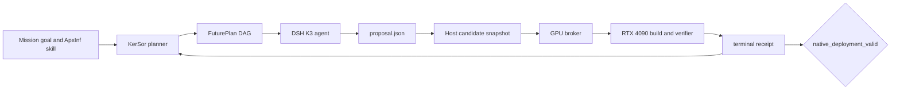

# Qwen-Drive on ApxInf with KerSor and DSH

Status: draft integration and optimization record.

This document describes an ongoing model-porting effort for
[Qwen-Drive-1.0-4B](https://huggingface.co/Qwen/Qwen-Drive-1.0-4B) in ApxInf.
The target is a native BF16 deployment on an NVIDIA RTX 4090, with the public
VQA, planning and perception paths kept behind ApxInf's normal policy and model
registration boundaries.

The code in this pull request is the current K3 candidate snapshot. It has been
compiled and executed on a real RTX 4090, but the complete four-mode acceptance
gate is still pending. This is intentionally a draft PR: it records the
integration surface and the agent-driven development method while the remaining
text-prefill path is being optimized.

## What this work adds

The port follows ApxInf's model-porting contract instead of adding a separate
runner or a model-specific service. The current candidate includes:

- Qwen-Drive model registration and `AutoPolicy` dispatch;
- checkpoint key normalization and mixed-dtype weight loading;
- device-resident language, vision, expert and planner state;
- the Python policy entry point and the existing PyO3 boundary;
- CUDA attention and linear-attention integration through ApxInf's kernel and
  FFI layers;
- the public Qwen-Drive inference path used by the Host-owned verifier.

The candidate preserves the official checkpoint and reference outputs. The
Host owns the checkpoint, test inputs, GPU allocation, timing limits and final
`native_deployment_valid` decision. A local build or a successful model import
does not satisfy that decision.

## How KerSor and DSH are used

[KerSor](https://github.com/qhy991/KerSor) is the workflow controller. Its
Mission-v1 runtime gives the model a bounded set of capabilities, compiles each
FuturePlan into a finite DAG, records immutable completed history, and asks for
a new plan only after a node exposes new evidence. The planner is guided by a
small set of composable topology principles: serial dependencies, logical
fork/join, fact-based routing, evidence checkpoints and frontier continuation.
The source workflow catalog is reference material; the planner designs the
current graph from the task and evidence.

DSH provides the model activation path. In this experiment the DSH application
uses the Infini-AI K3 route, while the KerSor Host keeps the write surface and
the remote evaluator separate. The model writes one complete `proposal.json`
candidate. The Host materializes that candidate into an isolated ApxInf
worktree, submits it through the GPU broker to the RTX 4090, and writes the
terminal receipt back to the same Mission.

Each revision has one proposal writer. Independent read-only analyses may be
represented as separate branches and joined by an evidence-review node, but the
current DSH Host serializes native calls. `await_lab` is an external checkpoint:
it returns `waiting` while the immutable remote job is running and resumes the
same Mission when a terminal receipt arrives.

## Evidence from the RTX 4090 run

The latest candidate was submitted to the exclusive GPU broker as a VQA
candidate. The evidence shows that the model is genuinely executing on the
target GPU:

| Stage | Observed result |
| --- | --- |
| GPU boundary check | Passed on RTX 4090, `sm_89` |
| CUDA build | Passed; the optimized release build completed in about 43 minutes |
| Native extension | Imported successfully |
| Model loading | 723 tensors loaded; 426 language tensors and 297 vision tensors became device resident in about 60 seconds |
| Vision path | All 24 vision blocks completed; `vision_done` and `embed_scatter_done` were emitted |
| Text prefill | Reached `prefill_layer k=3`; the first missing heartbeat was the following causal hdim256 path |
| VQA acceptance | Failed the fixed 300-second run limit before `inference_returned` |
| Four-mode deployment | Not yet accepted; the Host has not produced `native_deployment_valid=true` |

The timeout is therefore a real performance and integration boundary, not a
DSH connection failure or a model-load failure. The current follow-up revision
uses the measured vision result and targets the causal text-prefill route. It
does not claim that this repair has passed until a new RTX 4090 receipt exists.

## Development skill and review boundary

The ApxInf [model-porting skill](../skills/model-port-workflow/SKILL.md)
supplies the semantic contract: read the official reference, preserve checkpoint
names and public behavior, add the native model registration, keep CPU scaffolds
separate from device implementation, and use the fixed Host verifier for
acceptance. KerSor supplies the long-running plan,
resume and evidence loop around that skill. DSH supplies the model activation
and SSH-capable Host handoff; it does not become the correctness authority.

This division makes failures reviewable:

1. A planner decision is recorded with its dependencies and consumed evidence.
2. A source candidate is content-addressed before the Host submits it.
3. The broker receipt identifies the exact GPU job and candidate.
4. Build, load, inference and complete-mode results remain separate evidence
   layers.
5. Only the independent Host verifier can close the Mission.

The companion KerSor planning changes and their tests are in
[KerSor PR #117](https://github.com/qhy991/KerSor/pull/117). The parallel Codex
experiment reached native build/load and VQA diagnosis, but then stopped on
provider quota exhaustion; it has no new accepted ApxInf result to include in a
second PR at this time.

## Current next step

The next candidate replaces only the measured causal text-prefill bottleneck,
retains the working vision route and diagnostic markers, and reruns the same
Host-owned VQA gate. If that candidate reaches `inference_returned`, the
Mission can use the resulting evidence to decide whether to measure decode,
planning and perception modes. The PR should remain draft until the fixed
four-mode acceptance gate passes or the experiment is explicitly closed as a
negative result.
