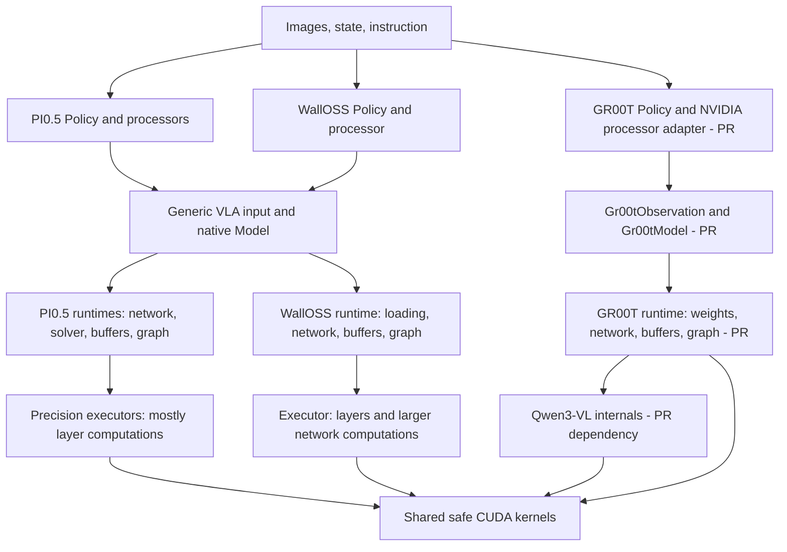
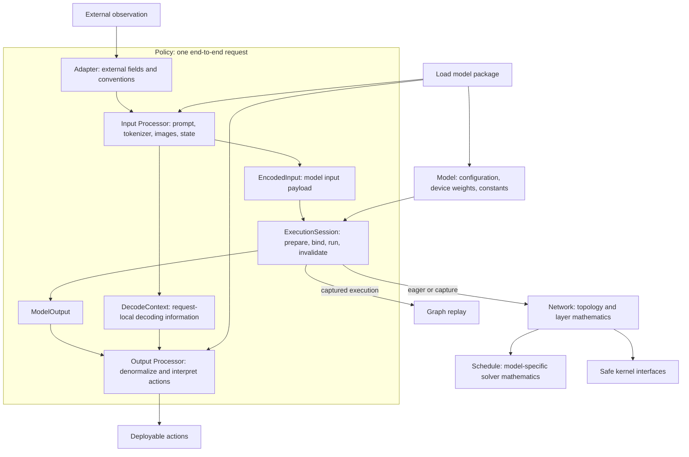
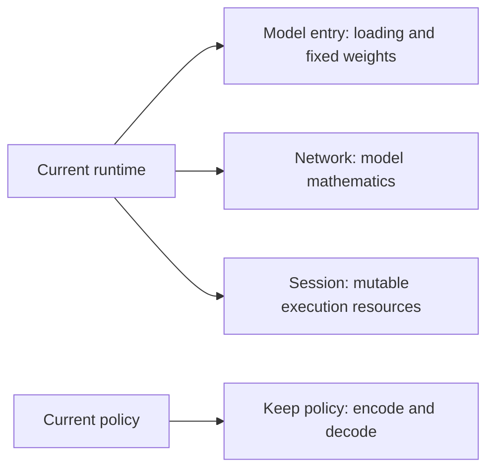
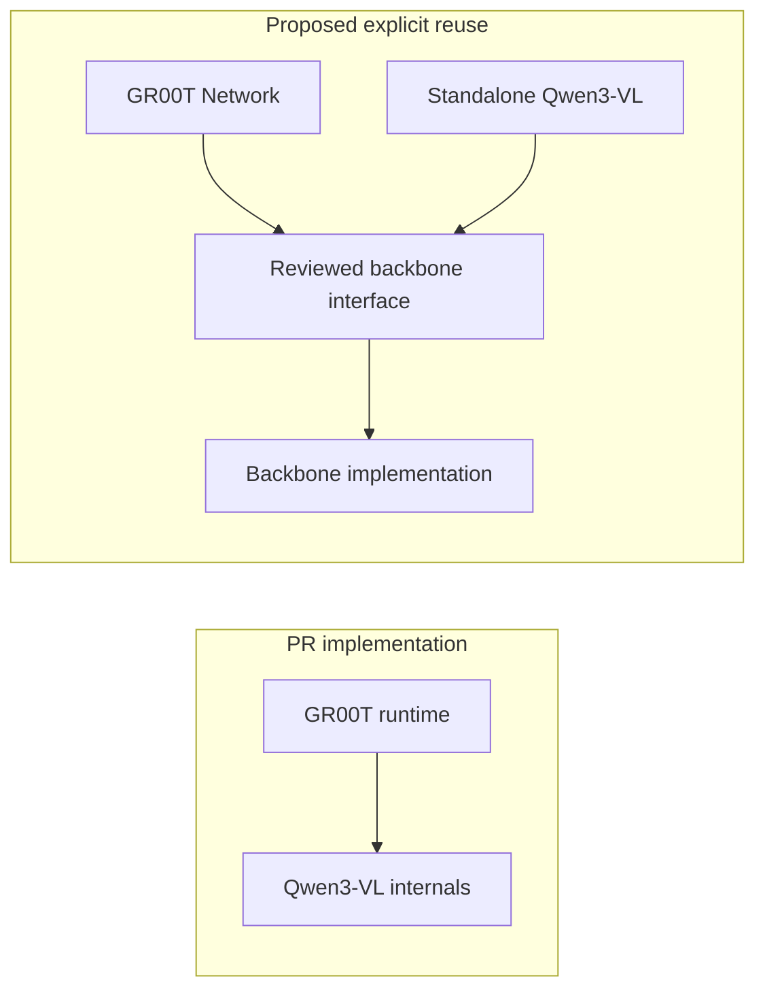

# Model lifecycle refactor: architecture proposal

Status: proposal; not the current implementation or an accepted ADR.

This proposal separates model semantics from execution resource management.
Policy owns end-to-end input/output semantics; Network owns model mathematics;
ExecutionSession owns preparation and repeated execution. It preserves direct
safe CUDA kernel calls and precision specialization.

The implementation baseline is `7126992` on upstream main. PI0.5 and WallOSS
observations below refer to that baseline. GR00T observations refer separately
to [PR #42](https://github.com/infinigence/ApxInf/pull/42), head
`01ad172474dfcc3d00c8fae3b5970e387ae1eb25`; they are not claims about merged code.
The PR author account is `Casten-Wang`. Its performance evidence has not been
reproduced for this design document.

Read [lifecycle contracts and migration](lifecycle.md) for stage guarantees,
resource lifetimes, acceptance criteria, and implementation slices. Existing
[model-layer architecture](../model-layer-architecture.md) remains the current
reference until a separately reviewed implementation changes it.

## Current logical view



The directory isolation is useful, but `runtime` has no consistent narrow
meaning. PI0.5 and WallOSS both keep network composition and solver orchestration
inside runtime files. GR00T's roughly 3,052-line runtime also holds device weight
conversion and capture management. Its `execution.rs` describes attention
selection and token grouping: those are network semantics, despite the name.

The generic VLA contract does not express all GR00T inputs. Its PR deliberately
uses a separate input and native entry point instead of widening that contract.
This is evidence for a common lifecycle protocol with typed model-specific
payloads, not for a universal optional-field tensor bag.

## Target logical view



| Module | Owns | Does not own |
| --- | --- | --- |
| Adapter | External field names, recording conventions and coordinate mappings | Tokenization, neural network mathematics |
| Policy | Encode/run/decode orchestration and request context | CUDA buffer layouts |
| Processor | Prompt templates, tokenizer use, image/state encoding, output decoding | Capture lifecycle or tactic invalidation |
| Loader / Model | Checkpoint interpretation, device weights, fixed assets and capabilities | Mutable per-request state |
| Network / Schedule | Layer ordering, conditioning, solver rules and precision specialization | Session cache policy or capture recovery |
| ExecutionSession | Input binding, workspaces, KV/latent state, RNG execution, capture/replay and invalidation | Prompt meaning or duplicated model mathematics |
| Backend | Model-neutral kernels, device memory and graph facilities | Family-specific scheduling decisions |

`DecodeContext` is request-local. GR00T's processor decodes actions using the
original state from the same request. Preserve this explicit dependency rather
than using mutable global "last observation" state. Other models may use an
empty context or retain state needed by relative-action transforms.

CPU/GPU placement does not determine semantic ownership. A Processor may define
an image normalization/patchification operation implemented by a backend kernel
and scheduled inside a captured Session. The formula has one owner while the
Session owns buffers and execution. Do not force CPU processing or materialize
an unnecessary host intermediate to satisfy the diagram.

## Current development view

Paths below are relative to the repository root. GR00T entries exist in PR #42.

```text
python/apxinf/apxinf/
  policies/impls/
    pi05.py             policy, loading and processor composition
    walloss.py          policy and model processor
    gr00t.py [PR]       policy and NVIDIA processor adapter
  processors/           shared processing utilities
  checkpoints/          checkpoint layouts and assets
  adapters/             external integrations

crates/apxinf-py/src/
  lib.rs                generic VLA binding, PI0.5 options, GR00T class in PR

crates/apxinf-model/src/
  auto.rs / registry.rs / builtin.rs
  vla/mod.rs            common VLA interfaces
  pi05/
    *_executor.rs       layer computations
    *_runtime.rs        network composition, resources, capture
    vla_runtime.rs      input routing, variants, prepared cache
  walloss/
    bf16_executor.rs    BF16 and dynamic FP8 computation
    bf16_runtime.rs     loading, network composition, execution
  gr00t/ [PR]
    input.rs            dedicated observation and inference specification
    execution.rs        attention semantics and token grouping
    checkpoint.rs / weights.rs / math.rs
    runtime.rs          multiple responsibilities
```

## Target development view

Keep the current packages and useful files. Responsibilities are not a file
checklist: do not create an assets module, loader module, processor package or
shared execution framework merely to mirror the logical diagram. Preserve
existing public imports. Split a file only when independent changes become
hard to locate or verify.

The minimal target adds one clear separation inside each model: network
mathematics versus session resource management. Loading and typed input
contracts can remain with the model entry point; schedule can remain with the
network. Existing well-scoped config, input and weight files may stay separate.

```text
python/apxinf/apxinf/
  policies/impls/
    pi05.py / walloss.py / gr00t.py   policy + encode/decode; private helpers OK
  processors/                       keep existing reusable transformations
  checkpoints/ / adapters/          keep existing responsibilities

crates/apxinf-py/src/
  lib.rs                            keep bindings here while manageable

crates/apxinf-model/src/
  auto.rs / registry.rs / builtin.rs keep registration and loading entry points
  vla/mod.rs                        lifecycle guarantees, not a new framework
  <pi05 | walloss | gr00t>/
    mod.rs                          model entry, loading, capabilities
    config.rs / weights*.rs         retain useful existing files
    network.rs                      network mathematics and schedule
    session.rs                      mutable buffers, prepare/run/invalidate
    ...                             retain justified precision/input files

crates/apxinf-cuda/
  kernels/ / workspace.rs / graph.rs keep existing device mechanisms
```

`network.rs` and `session.rs` are responsibility labels, not mandatory filenames
or size limits. Existing executors can become the network implementation without
being merged into one large file. Session can initially remain named runtime
while its mathematical responsibilities are removed. No new shared execution
directory is required: first reuse existing backend mechanisms, then extract a
small helper only when equivalent maintained callers demonstrate a need.



## What must actually improve?

Clear names and more files alone do not constitute improvement. The proposal
must reduce the independent places that own the same rule and the knowledge
needed to make a change. Validate these outcomes before calling a slice complete:

| Change or question | Current friction | Target evidence |
| --- | --- | --- |
| Change prompt or state encoding | Processor and binding responsibilities are not always obvious | Change model processing code without editing capture or network mathematics |
| Change solver mathematics | Network rules also live in runtime files, repeated by precision | One semantic owner, all supported precision paths checked against it |
| Fix capture cleanup or plan invalidation | Each runtime independently maintains lifecycle rules | Equivalent callers share the proven mechanism, or an explicit justified difference |
| Know whether preparation is complete | Prepare and first-run behavior differ across models | Same Ready guarantee, explicit execution strategy and measured first-run work |
| Determine if a graph is reusable | Some compatibility constraints are implicit | Each model declares all bound conditions and rejects incompatible requests |
| Add another model | Need to discover hidden shared-entry special cases | Predictable model-local implementation plus deliberate registration/contract changes |

No fixed file-count or LOC reduction target is useful before implementation.
Track touched responsibilities, duplicated invariants, public concepts callers
must understand, and correctness/performance evidence. Do not introduce a
pass-through module that merely forwards arguments to another module.

Dependency rules:

- Loader assembles Model; weights do not depend on Session.
- Session references Model and invokes Network; Network does not inspect
  serving state, graph cache policy, or capture strategy.
- Eager and captured execution use the same maintained network body.
- Model-local execution owns model-specific buffer layouts. Shared execution
  contains mechanisms supported by multiple implementations, without family switches.
- Raw CUDA mechanisms remain in `apxinf-cuda`; do not build a duplicate allocator
  or graph abstraction solely for this reorganization.
- Keep LLM/VLM token-generation and VLA action-generation contracts distinct.
  The initial implementation scope is these three VLA families.

## GR00T backbone reuse

PR #42 imports Qwen3-VL internals and modifies the family dependency checker to
allow that edge. This differs from main's copy-first family-isolation policy.
Do not silently treat the PR exception as an accepted architecture decision.

The proposed resolution is a deliberately reviewed backbone interface exposing
only required configuration/loading and feature computation. Start by narrowing
exports within Qwen3-VL; extract a shared backbone module only if both maintained
callers justify it. GR00T should not depend on arbitrary Qwen3-VL internal files.



## Evidence anchors

- `crates/apxinf-model/src/vla/mod.rs`: current Observation, InferenceSpec,
  VlaContract and PreparedInference.
- `crates/apxinf-model/src/pi05/vla_runtime.rs`: prepare-time capture, eager
  fallback, tactic-generation invalidation and cache replacement.
- `crates/apxinf-model/src/walloss/bf16_runtime.rs`: first-run capture, fixed
  workspace budget and captured latent-mode constraint.
- `python/apxinf/apxinf/policies/impls/{pi05,walloss}.py`: current encoding and decoding.
- PR #42 `gr00t/input.rs`, `gr00t/runtime.rs`, `policies/impls/gr00t.py` and
  `scripts/check_model_family_boundaries.sh`: specialized inputs, capture key,
  request-local decode state and the proposed Qwen3-VL dependency exception.
