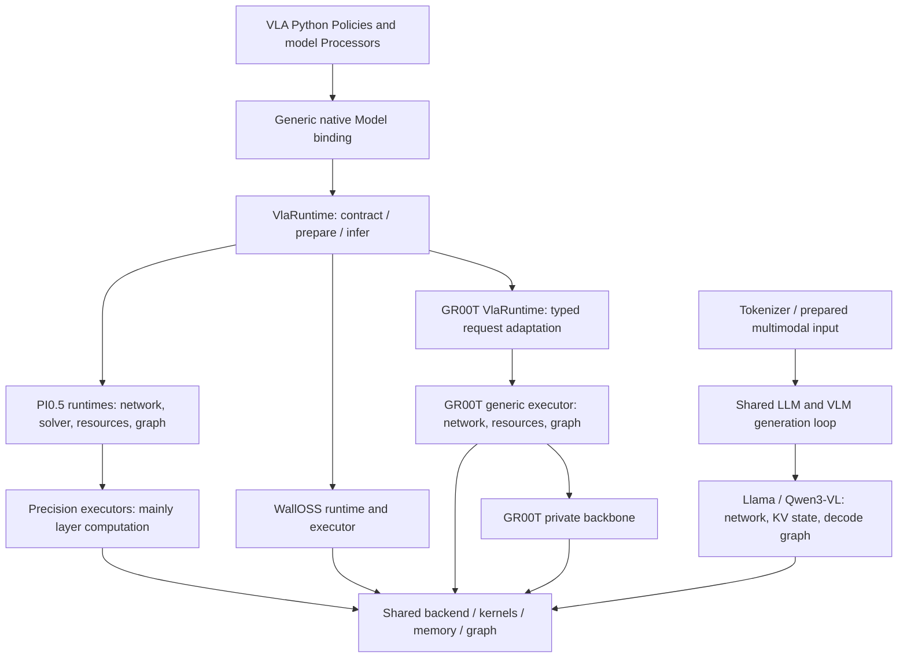
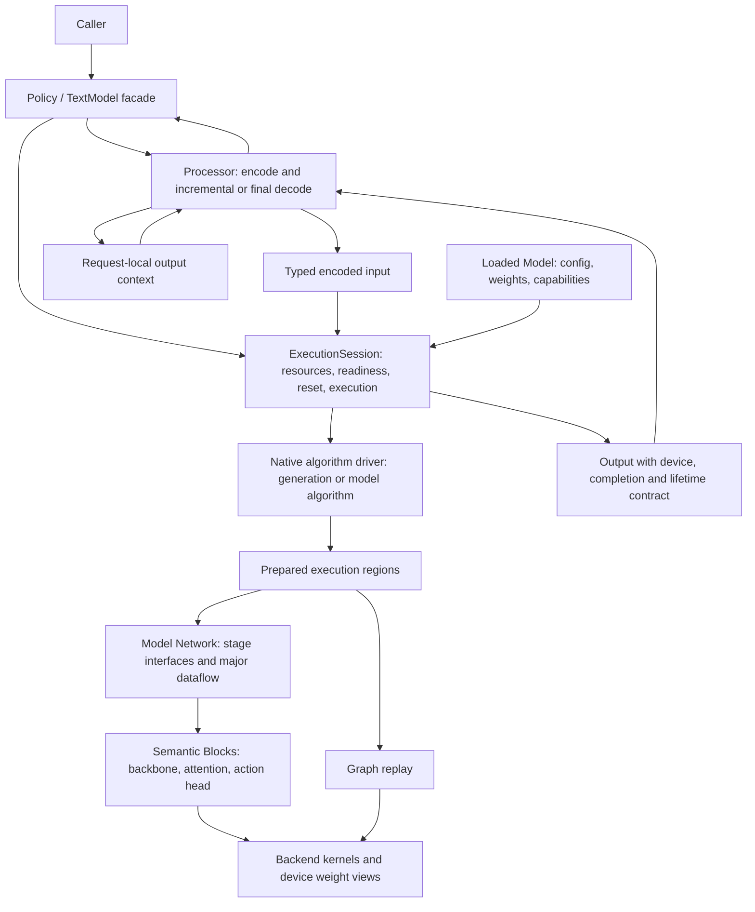

# Model architecture: current implementation and refactor specification

Status: agreed design direction from the architecture discussion; proposed interfaces,
not implemented APIs. Reviewed source baseline: upstream/main
`7baa69b281ef862e6afa32c476c58143d3964241` (GR00T N1.7 merged).
This document supersedes the earlier GR00T PR snapshot in this directory.
Stage 1 has since merged upstream/main `ee42185` (documentation-only changes
since the reviewed implementation); see [baseline protocol](baseline.md).
No GPU correctness or performance results are claimed by this documentation change.

Read [lifecycle contracts](lifecycle.md) and the [staged rollout](migration.md).
The existing [model-layer reference](../model-layer-architecture.md) describes
implementation guidance until individual migrations update it.

## Current logical view



GR00T now uses the generic Model/VlaRuntime entry and owns its backbone directory.
It is not an independent public Gr00tModel and does not need the earlier proposed
exception for importing sibling Qwen3-VL internals. Do not reintroduce a shared
backbone extraction merely to satisfy the obsolete proposal.

The remaining problems are semantic: `prepare` has different guarantees,
compatibility constraints are partly private, output residency differs, and
`runtime`/`executor` do not identify a consistent responsibility. LLM/VLM already
share a generation loop, but graph preparation and request state remain in models.

## Target logical view



The driver is a responsibility, often an existing function, not a mandatory class.
Algorithm control remains in native code; do not round-trip through Python per
network layer or denoising step. A fixed flow loop may be captured as one region.

| Module | Interface role | Owns |
| --- | --- | --- |
| Policy / TextModel | infer / generate | Encode-execute-decode orchestration |
| Processor | encode -> typed input + context; decode -> user output | Prompt, tokenizer, image/state semantics, incremental text or action decoding |
| Loaded Model | load; create_session | Config, resident weights, capabilities and network construction |
| ExecutionSession | prepare; infer/generate; reset_request; clear_plans | Stable buffers, workspace, KV/latent storage, plans, invalidation and completion |
| Algorithm driver | generate or model-specific inference algorithm | Sampling, EOS, iteration/update rules; request progression |
| Network | prefill/decode or encode_condition/predict_velocity | Model-level tensor interfaces and major subnetwork connections |
| Block | Typed tensor/state transformation | Internal layer composition and precision-specific implementation |
| Backend | Kernels, allocation, capture/replay, events | Device mechanisms, not model semantics |

Processor is not synonymous with CPU execution. GPU preprocessing can be captured
without transferring formula ownership to Session. A learned vision encoder is a
Network/Block, not a tokenizer/image Processor. Sampling and EOS belong to the
algorithm; text detokenization belongs to Processor.

## Network / Block seam

Each model has one maintained Network definition where practical. A Block is an
internally cohesive transformation, not necessarily one transformer layer.
Backbones and action heads are large Blocks and may contain smaller Blocks.
Preserve meaningful names such as `vision` and `action`, rather than renaming
all types to generic Block names.

Network connects major subnetworks and exposes computation stages. Blocks hide
local topology, physical layouts and precision-specific fusion. A change to the
vision-to-language connection belongs in Network; changing QKV packing or fused
norm/quantization belongs in the relevant Block and its weight materialization.
If reusable quantized input spans projections, group those projections rather
than exposing that temporary to Network. Do not force conversions at every Block
boundary to make interfaces look uniform. Typed internal values or a larger Block
may preserve a continuous quantized path.

```rust
// Conceptual pseudocode; no mandatory public generic framework.
struct GrootNetwork<V, L, A> { vision: V, language: L, action: A }
fn encode_condition(input, state, ctx) -> Condition {
    images = vision.forward(input.pixels, input.grid, ctx);
    language.prefill(input.tokens, images, input.mask, state, ctx)
}
fn predict_velocity(condition, latent, time, state, ctx) -> Tensor {
    action.forward(condition, latent, time, state, ctx)
}
// A concrete FFN implementation may fuse norm + quantization + projections.
// It exposes the FFN result, not its internal quantized scratch buffers.
```

A Block can describe resource requirements; Session owns their allocation and
lifetime. ExecContext provides bounded device/resource access, not arbitrary
access to the whole Session. Network does not manage graph caching or serving.
Eager and capture must use the same maintained computation semantics. Proven
precision-specific fusion is permitted; a duplicate capture-only network is not
the default architecture. Public Network factories and per-layer dynamic Block
traits are not required. Select precision at construction and retain static
specialization in hot paths.

## Weight and precision ownership

| Current file/content | Target responsibility |
| --- | --- |
| runtime loading | Model construction |
| runtime/executor capture, buffers, cache | Session |
| runtime/executor major computation | Network |
| executor attention/FFN computation | Blocks |
| generation loop / flow update | Native algorithm driver or model algorithm function |
| weights.rs checkpoint mappings and validation | Model weights/loading |
| static_*_weights.rs whole-model resident tree | Model resident weights, parameterized when structure matches |
| device_weights.rs matrix representation and compute | Shared or Block-local weight/compute implementation |
| kernel weight views | Backend's non-owning device interface |

Names currently mean different things: PI0.5 device_weights.rs holds FP8 linear
storage and packing; static_weights.rs holds the PI0.5-wide resident weight tree.
GR00T device_weights.rs is a private precision-neutral computation contract.
Backend FP8/W8A8 weight views are already model-neutral. Do not move an entire
model weight tree into shared code just because its filename says static.

Reuse model structure and checkpoint mapping across precision implementations.
Keep genuinely different scales, layouts, quantization, packing and fused compute.
Precision may differ between vision, text and action; one dtype parameter for all
fields is not a requirement. GR00T already has a precision-parameterized executor:
preserve that progress rather than creating three copies of Network.

## Target development view

Prefer semantic grouping before dtype grouping. This is a placement guide, not a
mandatory file checklist. Small Blocks and weights can remain single files.

```text
crates/apxinf-model/src/
  auto.rs / registry.rs / builtin.rs   existing model construction
  llm_trait.rs or generation.rs        shared native generation algorithm
  vla/                                VLA public contracts
  <model>/
    mod.rs                            model entry and capabilities
    network.rs                        one major dataflow definition
    session.rs                        model-specific bindings and plan requirements
    weights.rs                        checkpoint schema and resident weight tree
    blocks/
      vision/                         backbone and its inner blocks
      language/
      action/
        mod.rs                        semantic interface / shared implementation
        bf16.rs / fp8.rs / w8a8.rs     only where implementations actually differ
crates/apxinf-cuda*/                   backend mechanisms and kernel weight views
python/apxinf/.../policies/            VLA facade and model processing
crates/apxinf-tokenizer/               existing tokenizer capability
```

Do not create three parallel complete trees under blocks/bf16, blocks/fp8,
blocks/w8a8 by default. A model-wide precision directory is not required; local
compute specialization belongs beside its semantic Block, common matrix storage
belongs in a demonstrated shared module, and quantization selection belongs in
construction. Keep checkpoint mapping separate from kernel physical layout.

Independent correctness/performance reference implementations are harnesses,
not alternate production Networks. Maintained reusable harnesses belong in the
established tests/benchmark locations; temporary comparisons, scripts and logs
belong in ignored `devlocal/model-lifecycle-refactor/` within the active worktree.
Do not create a shared backbone without multiple maintained consumers and a
reviewed narrow interface. Cross-model reuse is not implied by similar names.

## Change-locality acceptance

| Change | Expected owner |
| --- | --- |
| Prompt or action interpretation | Processor |
| FP8 FFN fusion | Corresponding Block implementation |
| QKV physical layout | Block weight materialization and compute |
| Compatible backbone replacement | Block implementation and model construction |
| Vision/language connection | Network |
| Capture recovery or cache eviction | Session/backend mechanism |
| EOS or sampling policy | Generation driver / sampler |

More files or renamed executors do not prove improvement. Each migration must
show that these changes have predictable owners and that hidden invariants have
become explicit contracts. See migration.md for evidence and documentation gates.
