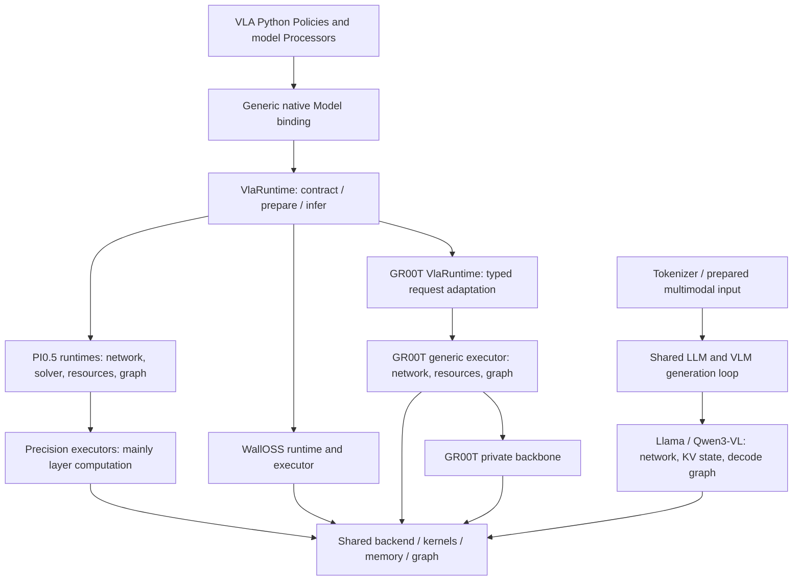
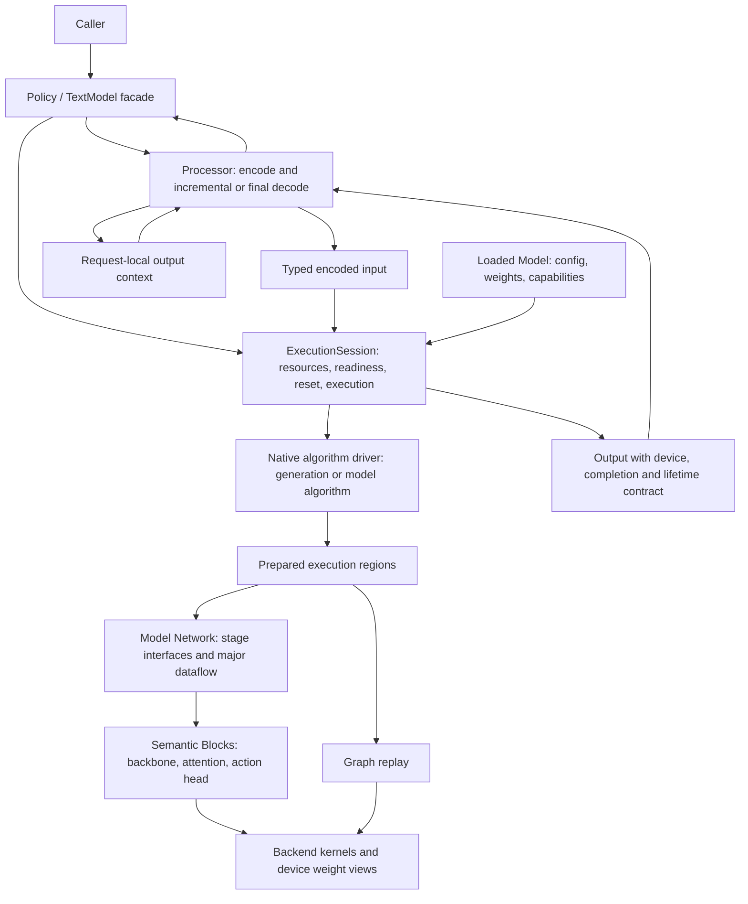
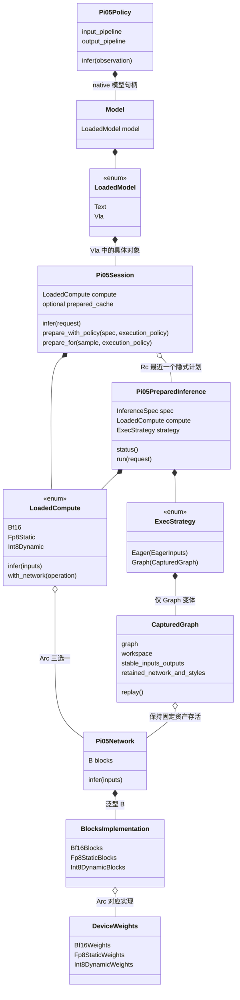
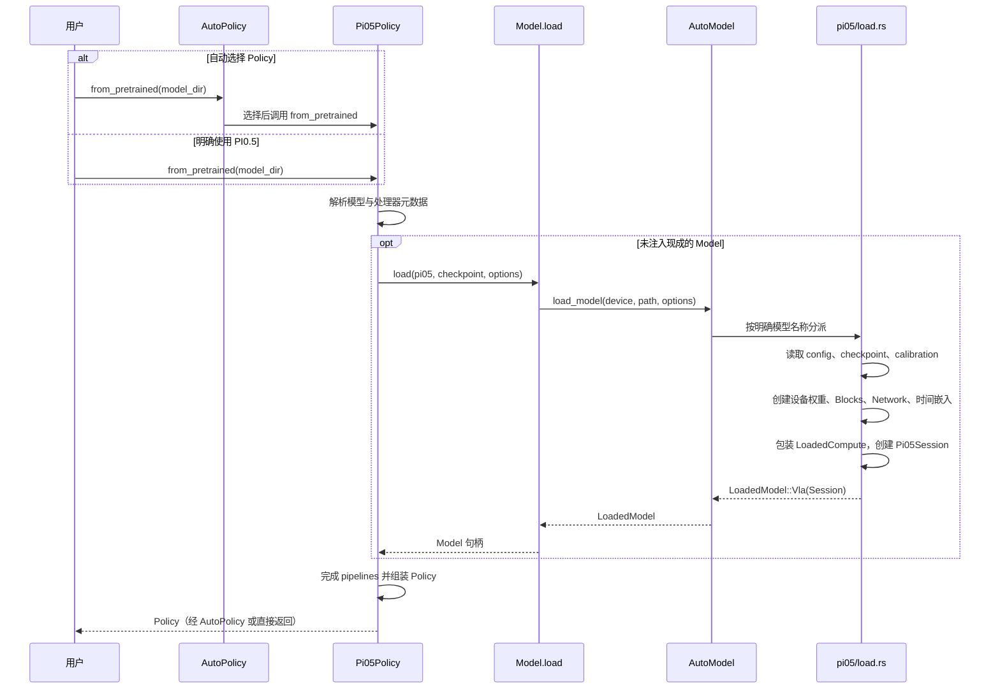
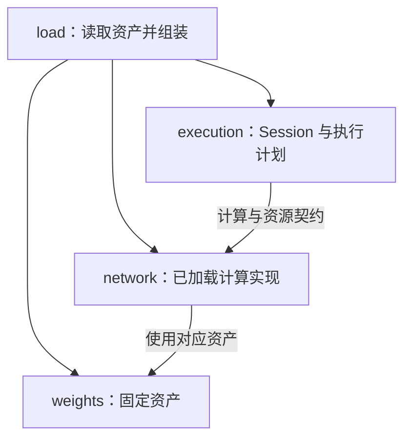

# Model architecture: current implementation and refactor specification

Status: agreed design direction; target interfaces are proposals except in the
explicitly marked implemented PI0.5 section. Reviewed source baseline: upstream/main
`7baa69b281ef862e6afa32c476c58143d3964241` (GR00T N1.7 merged).
This document supersedes the earlier GR00T PR snapshot in this directory.
Stage 1 has since merged upstream/main `ee42185` (documentation-only changes
since the reviewed implementation); see [baseline protocol](baseline.md).
GPU evidence and its limits are recorded in the baseline and migration documents.

Read [lifecycle contracts](lifecycle.md) and the [staged rollout](migration.md).
The existing [model-layer reference](../model-layer-architecture.md) describes
implementation guidance until individual migrations update it.

阅读当前 PI0.5 实现请直接查看[对象关系、加载调用链与权重结构](#implemented-pi05-pilot-stage-2)。
前面的 baseline/target 图用于历史对比，不代表本分支当前的对象持有关系。

## Baseline logical view (selected main)



GR00T now uses the generic Model/VlaRuntime entry and owns its backbone directory.
It is not an independent public Gr00tModel and does not need the earlier proposed
exception for importing sibling Qwen3-VL internals. Do not reintroduce a shared
backbone extraction merely to satisfy the obsolete proposal.

The remaining problems are semantic: `prepare` has different guarantees,
compatibility constraints are partly private, output residency differs, and
`runtime`/`executor` do not identify a consistent responsibility. LLM/VLM already
share a generation loop, but graph preparation and request state remain in models.

## Target logical view



The driver is a responsibility, often an existing function, not a mandatory class.
Algorithm control remains in native code; do not round-trip through Python per
network layer or denoising step. A fixed flow loop may be captured as one region.

| Module | Interface role | Owns |
| --- | --- | --- |
| Policy / TextModel | infer / generate | Encode-execute-decode orchestration |
| Processor | encode -> typed input + context; decode -> user output | Prompt, tokenizer, image/state semantics, incremental text or action decoding |
| Loaded Model | load; create_session | Config, resident weights, capabilities and network construction |
| ExecutionSession | prepare; infer/generate; reset_request; clear_plans | Stable buffers, workspace, KV/latent storage, plans, invalidation and completion |
| Algorithm driver | generate or model-specific inference algorithm | Sampling, EOS, iteration/update rules; request progression |
| Network | prefill/decode or encode_condition/predict_velocity | Model-level tensor interfaces and major subnetwork connections |
| Block | Typed tensor/state transformation | Internal layer composition and precision-specific implementation |
| Backend | Kernels, allocation, capture/replay, events | Device mechanisms, not model semantics |

Processor is not synonymous with CPU execution. GPU preprocessing can be captured
without transferring formula ownership to Session. A learned vision encoder is a
Network/Block, not a tokenizer/image Processor. Sampling and EOS belong to the
algorithm; text detokenization belongs to Processor.

## Network / Block seam

Each model has one maintained Network definition where practical. A Block is an
internally cohesive transformation, not necessarily one transformer layer.
Backbones and action heads are large Blocks and may contain smaller Blocks.
Preserve meaningful names such as `vision` and `action`, rather than renaming
all types to generic Block names.

Network connects major subnetworks and exposes computation stages. Blocks hide
local topology, physical layouts and precision-specific fusion. A change to the
vision-to-language connection belongs in Network; changing QKV packing or fused
norm/quantization belongs in the relevant Block and its weight materialization.
If reusable quantized input spans projections, group those projections rather
than exposing that temporary to Network. Do not force conversions at every Block
boundary to make interfaces look uniform. Typed internal values or a larger Block
may preserve a continuous quantized path.

```rust
// Conceptual pseudocode; no mandatory public generic framework.
struct GrootNetwork<V, L, A> { vision: V, language: L, action: A }
fn encode_condition(input, state, ctx) -> Condition {
    images = vision.forward(input.pixels, input.grid, ctx);
    language.prefill(input.tokens, images, input.mask, state, ctx)
}
fn predict_velocity(condition, latent, time, state, ctx) -> Tensor {
    action.forward(condition, latent, time, state, ctx)
}
// A concrete FFN implementation may fuse norm + quantization + projections.
// It exposes the FFN result, not its internal quantized scratch buffers.
```

A Block can describe resource requirements; Session owns their allocation and
lifetime. ExecContext provides bounded device/resource access, not arbitrary
access to the whole Session. Network does not manage graph caching or serving.
Eager and capture must use the same maintained computation semantics. Proven
precision-specific fusion is permitted; a duplicate capture-only network is not
the default architecture. Public Network factories and per-layer dynamic Block
traits are not required. Select the compute variant at construction and retain static
specialization in hot paths.

## Compute implementation selection (agreed target)

Use `compute_variant` for the single user-facing choice of a model's compute
implementation. It selects a compatible bundle of Blocks, physical weight
representations and preparation requirements; it is not merely a dtype or a
checkpoint/model-size variant. Do not add independently combinable quantization
and implementation fields until a real use case requires them.

The field name and selection contract are shared across models. Supported values
belong to each model: do not create one global enum containing every model's
implementations. Within a model module, use `ComputeVariant`; if a flattened
public export is needed, an alias such as `Pi05ComputeVariant` disambiguates it.
The prefix identifies ownership, not a different lifecycle contract.

```rust
// Implemented PI0.5 selection. Shared LoadOptions carries a model-local ID.
let options = LoadOptions {
    compute_variant: Some(pi05::ComputeVariant::Fp8Static.as_str().into()),
    ..LoadOptions::default()
};
// pi05::ComputeVariant::{Auto, Bf16, Fp8Static, Int8Dynamic}
```

Rust and Python use `compute_variant`; canonical values are `auto`, `bf16`,
`fp8_static`, `int8_dynamic`. PI0.5 rejects explicit legacy `precision` and
ambiguous IDs such as `fp8` or `w8a8`. Other models retain their existing precision
interfaces until migrated and reject compute_variant through the current common
loader. Stage 3 extends this support when WallOSS migrates; it does not introduce
a global enum of every model's variants or a registration framework.

`Auto` is resolved once during loading: static FP8 on SM100+ with calibration
(or explicitly supplied uniform diagnostic scales), dynamic INT8 on SM80–SM99,
and BF16 otherwise. Explicit choices retain existing kernel fallback behavior;
this selection rule is not a declaration that all hardware/profile combinations
are qualified. The resolved ID is logged. The loader creates matching Blocks and
injects them into `Pi05Network::from_blocks`. Selection and typed dispatch are
split by lifetime: `load.rs` selects during loading, while `network/compute.rs`
owns typed execution dispatch. Session and the model dataflow do not match variants.

Each value selects a complete compute implementation, including numerical
formats and preparation requirements. `fp8_static` means fixed calibration-based
activation scales. `int8_dynamic` means fixed per-output-channel weight scales
and runtime per-row activation scales; it is not a dynamically changing model
or a static-activation INT8 implementation. W8A8 remains useful kernel storage
terminology but is not the model's variant ID. Same-precision alternatives can
add values when actually implemented.

## Weight and precision ownership

| Current file/content | Target responsibility |
| --- | --- |
| runtime loading | Model construction |
| runtime/executor capture, buffers, cache | Session |
| runtime/executor major computation | Network |
| executor attention/FFN computation | Blocks |
| generation loop / flow update | Native algorithm driver or model algorithm function |
| weights.rs checkpoint mappings and validation | Model weights/loading |
| static_*_weights.rs whole-model resident tree | Model resident weights, parameterized when structure matches |
| device_weights.rs matrix representation and compute | Shared or Block-local weight/compute implementation |
| kernel weight views | Backend's non-owning device interface |

Names currently mean different things: PI0.5 device_weights.rs holds FP8 linear
storage and packing; static_weights.rs holds the PI0.5-wide resident weight tree.
GR00T device_weights.rs is a private precision-neutral computation contract.
Backend FP8/W8A8 weight views are already model-neutral. Do not move an entire
model weight tree into shared code just because its filename says static.

Reuse model structure and checkpoint mapping across precision implementations.
Keep genuinely different scales, layouts, quantization, packing and fused compute.
Precision may differ between vision, text and action; one dtype parameter for all
fields is not a requirement. GR00T already has a precision-parameterized executor:
preserve that progress rather than creating three copies of Network.

## Target development view

Prefer semantic grouping before dtype grouping. This is a placement guide, not a
mandatory file checklist. Small Blocks and weights can remain single files.

```text
crates/apxinf-model/src/
  auto.rs / registry.rs / builtin.rs   existing model construction
  llm_trait.rs or generation.rs        shared native generation algorithm
  vla/                                VLA public contracts
  <model>/
    mod.rs                            model entry and capabilities
    network.rs                        one major dataflow definition
    session.rs                        model-specific bindings and plan requirements
    weights.rs                        checkpoint schema and resident weight tree
    blocks/
      vision/                         backbone and its inner blocks
      language/
      action/
        mod.rs                        semantic interface / shared implementation
        bf16.rs / fp8_static.rs / int8_dynamic.rs     only where implementations actually differ
crates/apxinf-cuda*/                   backend mechanisms and kernel weight views
python/apxinf/.../policies/            VLA facade and model processing
crates/apxinf-tokenizer/               existing tokenizer capability
```

Do not create three parallel complete trees under blocks/bf16, blocks/fp8_static,
blocks/int8_dynamic by default. A model-wide precision directory is not required; local
compute specialization belongs beside its semantic Block, common matrix storage
belongs in a demonstrated shared module, and quantization selection belongs in
construction. Keep checkpoint mapping separate from kernel physical layout.

Independent correctness/performance reference implementations are harnesses,
not alternate production Networks. Maintained reusable harnesses belong in the
established tests/benchmark locations; temporary comparisons, scripts and logs
belong in ignored `devlocal/model-lifecycle-refactor/` within the active worktree.
Do not create a shared backbone without multiple maintained consumers and a
reviewed narrow interface. Cross-model reuse is not implied by similar names.

## Change-locality acceptance

| Change | Expected owner |
| --- | --- |
| Prompt or action interpretation | Processor |
| FP8 FFN fusion | Corresponding Block implementation |
| QKV physical layout | Block weight materialization and compute |
| Compatible backbone replacement | Block implementation and model construction |
| Vision/language connection | Network |
| Capture recovery or cache eviction | Session/backend mechanism |
| EOS or sampling policy | Generation driver / sampler |

More files or renamed executors do not prove improvement. Each migration must
show that these changes have predictable owners and that hidden invariants have
become explicit contracts. See migration.md for evidence and documentation gates.

## Implemented PI0.5 pilot (Stage 2)

The extended Stage 2 candidate removes all three PI0.5 runtime files and their
compatibility types. This view describes the refactor branch, not unmigrated
families. The implemented CPU/CUDA checks and native qualification status are
tracked separately in [baseline.md](baseline.md).

### 对象关系：谁持有谁

本图只表达持有关系，不表达加载顺序或调用顺序。`*--` 实心菱形表示
拥有成员；`o--` 空心菱形表示共享持有，具体以 Rust 的 `Arc` / `Rc` 为准。
菱形位于持有者一端。`..>` 表示调用依赖，留给时序图表达，不混入本图。



`Pi05Policy` 在 Python 层，`Model` 是 native binding 对象，其余是 Rust 类型。
`BlocksImplementation` 和 `DeviceWeights` 仅为图中的分组，不是实际基类；
三种 Blocks 分别实现 `Blocks` 与 `PrepareBlocks` trait。`Pi05Network<B>`
共享一份源码，由 Rust 静态特化。`LoadedCompute` 是带数据的 enum，其方法集中
转发到对应 Network，不重复实现模型数学计算，也不管理计划缓存。

- **Policy = Model + 输入/输出 pipelines**。Model 不包含 tokenizer 或动作反归一化。
- **Model 间接持有 Session**，是包含执行状态的用户侧句柄。`LoadedModel::Vla`
  是统一容器的一个变体，不是另一个名叫 LoadedVla 的执行对象。
- **LoadedCompute 是 PI0.5 内部的已加载计算实现**，含 Network 和时间嵌入。
  `LoadedModel` 区分 Text/VLA 接口；`LoadedCompute` 区分 PI0.5 的计算实现。
- **Session 和计划没有互相持有**。计划不引用 Session；两者共享 Network。
  清除隐式缓存或释放 Session，不会销毁调用方仍持有的显式计划。
- **CapturedGraph 拥有 graph 和工作区，并保留 Network 引用**。CUDA Graph 使用
  设备地址，不会自动替 Rust 持有权重；这条引用链防止 graph 活着而权重先释放。
  共享引用不复制权重。graph 先于其引用的内存释放。

### 加载调用链：谁创建这些对象

AutoPolicy 选择 Policy 类；AutoModel 是统一 native 加载入口，也接受明确的
模型名称。它们不是必须成对使用的对象。直接调用 Pi05Policy 只跳过 AutoPolicy；
当前没有独立的 Python Pi05Model 类。所有分派发生在加载时，不是每次推理时。



`Model.load()` 返回 Model，不返回 LoadedCompute。普通 Python 调用为
`policy = Pi05Policy.from_pretrained(path, compute_variant="bf16")`，随后
`policy.infer(observation)`。它执行 input_pipeline → Model.infer_rgb →
Session.infer → output_pipeline。处理后的 observation 还会传给输出 pipeline，
供状态相关的机器人适配使用。encode/decode 是概念描述，不是同名 Rust 接口。

### 权重结构与归属

`weights/host.rs` 的 `Pi05Weights` 是共同的 PI0.5 checkpoint 逻辑树：vision、
language_layers、action_layers、norm、action_in/out 和 time_mlp_in/out。
加载时转换为三种并列的设备结构，由对应 Blocks 持有，Network 不访问具体布局。

| 文件 | 内容 |
| --- | --- |
| host.rs | checkpoint 映射和 PI0.5 逻辑权重树；不是跨模型统一权重树 |
| packing.rs | 共用矩阵拼接工具，不依附 FP8 实现 |
| bf16.rs | Bf16Weights；linear 存储含 BF16 Tensor、bias 和可选特殊布局 |
| fp8_static.rs | Fp8StaticWeights；linear 存储含 E4M3 Tensor、weight scale 和布局 |
| int8_dynamic.rs | Int8DynamicWeights；INT8 buffer、每输出通道 weight scales、bias |
| fp8_static_calibration.rs | FP8 表示、校准 profile 和固定激活 scales |

静态 FP8 的激活 scales 来自校准；动态 INT8 的激活 scales 在运行时按行生成，
权重 scales 仍固定。每种设备文件内部包含 linear 子模块和模型聚合结构，
没有另建三套 Network，也没有把通用打包操作放在某个 dtype 的文件下。

```text
pi05/
  mod.rs                       public exports and registration
  config.rs                    fixed model configuration and compute_variant
  load.rs                      checkpoint loading and module assembly
  backend.rs                   model-wide accelerator seam
  math.rs                      CPU-capable model math helpers
  execution/
    mod.rs                     Session / plan / low-level capture exports
    session.rs                 private state, input binding, cache and validity
    prepare.rs                 allocation, warmup, capture and graph ownership
  network/
    mod.rs                     model dataflow and computation/resource interface
    compute.rs                 construction, LoadedCompute and static dispatch
    calibration.rs             private BF16 observer and diagnostic traversal
    blocks/
      mod.rs                   semantic Blocks contract
      bf16.rs                  BF16 backbone and layers
      fp8_static.rs            static FP8 backbone and layers
      int8_dynamic.rs          dynamic-activation INT8 backbone and layers
  weights/
    mod.rs                     fixed-asset exports
    host.rs                    PI0.5 checkpoint mapping and logical weight tree
    packing.rs                 shared model-local host matrix packing
    bf16.rs                    BF16 linear storage and device model tree
    fp8_static.rs              static FP8 linear storage and device model tree
    int8_dynamic.rs            INT8 linear storage and device model tree
    fp8_static_calibration.rs  calibration profile and fixed scales
```

The tree has 22 Rust files (20 before this module encapsulation); the model
root has five files. The extra files are execution/mod.rs and network/compute.rs,
which provide module ownership and loaded-computation dispatch rather than new
per-layer abstractions. Each device-weight file groups its linear storage in
an internal module and its aggregate model tree in the same file. Backbone/layer
code also remains grouped per variant instead of expanding into many one-function
files. Cross-model matrix/view reuse remains a later evidence-driven extraction;
PI0.5's own weight organization is complete in this stage.

Network owns the full model order and flow step count/dt. Blocks own backbone
layer loops, fusion, physical layout and fixed weights. The model dataflow methods depend on the Blocks contract; the network module
exports and compute adapter select concrete implementations. BF16-only calibration
traversal lives privately in network/calibration.rs.
Rust statically specializes the Network for each implementation. `network/compute.rs` wraps
these types for the public Session; no per-layer virtual calls are introduced.

Blocks report workspace requirements and perform their native input conversion.
Session allocates request/noise buffers; `execution/prepare.rs` allocates graph workspace
and capture-specific resources, prepares fixed styles, warms up until tactics
stabilize, captures with the shared CUDA scope, and returns a single CapturedGraph
for every variant. Its erased fixed-resource owner retains the concrete Network
and style tensors; this erases ownership storage only, not computation dispatch.
The executable graph is dropped before the memory it references.

Session owns the preparation policy, request validation, RNG rebinding, tactic
invalidation and implicit cache. It does not choose FP8/INT8 implementations or
manage separate precision graph types. There is no replacement runtime facade.
Low-level diagnostic callers construct a Network with `build_*_network`, call
its computation methods, and explicitly use `capture_patches` or `capture_rgb`.
Ordinary callers use AutoModel and prepare/run.

### 三个 module 的 Interface 与依赖约束



- `execution` 拥有策略、缓存、有效性、输入/noise buffer 和 graph 资源。
  Session 字段私有；load 调用 `Pi05Session::new`，不能初始化或修改缓存字段。
- `network` 拥有 LoadedCompute、时间嵌入、具体实现分派和 Blocks。计算顺序仍是
  一份 `Pi05Network<B>`。Blocks 成员和实现模块私有，执行层不能直接访问。
- `weights` 保留模型逻辑权重树和设备表示，不依赖 network 或 execution。
  本轮不提取跨模型权重、不修改 packing、量化或设备内存算法。
- `PrepareBlocks` 和 `WorkspaceRequirements` 归 network，描述所需资源，不执行分配。
  execution 通过 Network 方法查询需求并分配，network 不认识执行策略或 CapturedGraph。
- 录图分派由 execution 的 `CaptureOperation` 发起：调用
  `LoadedCompute::with_network(operation)`，后者按具体实现调用泛型 `operation.run`。
  `NetworkOperation` 只是 PI0.5 内部的静态分派 Interface，network 不导入 execution；
  execution 不 match 具体 variant，也没有逐层动态派发。
- `backend.rs` 留在根目录，因为 weights、network、execution 都使用它。
  `math.rs` 保持 CPU 可用，不被 CUDA 专属 network 模块的 feature gate 隐藏。
  BF16 校准遍历归 network 内部，以便不向 execution 暴露 Blocks/权重字段。

普通用户仍通过 Policy/Model 使用 Session；已有低层构造、计算和 capture 导出
供仓库诊断/benchmark 使用，不新增转发对象。目录层级服务职责封装，不要求每个文件
都有独立公共类型。未使用全面 `pub(crate)` 放开字段来迁就移动。

`scripts/check_model_family_boundaries.sh` 同时执行
`check_pi05_module_boundaries.py`：检查 network 不依赖 execution/Session/执行策略，
weights 不依赖 network/execution，execution 不依赖具体 Blocks 或 match
LoadedCompute 变体，load 不直接构造 Session 字段。Rust 隐私检查进一步限制访问。
该脚本检查显式依赖，不代替编译器或完整 Rust AST 分析。

| 修改任务 | 所属 module | 验证入口 |
| --- | --- | --- |
| 缓存、策略、失效和计划寿命 | execution | Session/lifecycle tests |
| 模型流程或某种 Blocks | network | 固定输入 eager/graph 数值对照 |
| checkpoint 映射和设备布局 | weights | 权重测试与实际 checkpoint 集成 |
| 模型加载组装 | load | 加载与 public smoke |

### Breaking interface migration

| Previous PI0.5 entry | Current entry |
| --- | --- |
| precision=fp8 / bf16 / int8 or w8a8 | compute_variant=fp8_static / bf16 / int8_dynamic |
| Pi05CudaRuntime::new | build_fp8_static_network |
| Pi05Bf16CudaRuntime::new | build_bf16_network |
| Pi05Int8CudaRuntime::new | build_int8_dynamic_network |
| runtime.capture_infer / capture_infer_rgb_u8 | capture_patches(&network, ...) / capture_rgb(&network, ...) |
| Three precision CapturedGraph types | CapturedGraph |
| StaticFp8Pi05Weights / StaticBf16Pi05Weights / StaticInt8Pi05Weights | Fp8StaticWeights / Bf16Weights / Int8DynamicWeights |
| Pi05ActivationScales / StaticFp8Calibration | Fp8StaticActivationScales / Fp8StaticCalibration |
| Unprefixed FP8 layer functions/types | Explicit fp8_static / Fp8Static names |
| Pi05VlaRuntime alias | Pi05Session |
| pi05_bench --dtype fp8; JSON precision key | --compute-variant fp8_static; JSON compute_variant key |
| Python Model.random(precision=...) | Model.random(compute_variant=...) |

Repository callers are migrated. External low-level Rust callers, Python keyword
callers and benchmark parsers must update. Existing checkpoint/calibration/tactic
asset schemas are preserved; operator names such as W8A8 are not renamed globally.
GR00T/WallOSS numerical implementations are unchanged. The shared LoadOptions
still contains legacy precision for those families, not a second PI0.5 selector.
Dedicated PI0.5 benchmark/server tools use compute_variant. The multi-model LIBERO
campaign tool retains its numerical precision ledger category, translating that
category to PI0.5's implementation ID at loading; historical campaign ledgers
are not rewritten. Its websocket boundary recognizes the new server metadata.

### Internal interfaces and change ownership

```rust
// Abbreviated signatures; the callable implementation lives in network/blocks/mod.rs.
trait Blocks {
    type Prefix;   // precision-specific KV representation
    type Styles;   // fixed per-step modulation tensors
    fn vision(patches, native_representation) -> Tensor;
    fn embed_prefix(vision, token_ids, token_count) -> Tensor;
    fn prefix(embeddings) -> Self::Prefix;
    fn prepare_styles(time_embeddings) -> Vec<Self::Styles>;
    fn eager_styles(time_embeddings) -> Option<Vec<Self::Styles>>;
    fn step(state, time_embedding, prefix, dt) -> Tensor;
    fn step_with_styles(state, styles, prefix, dt) -> Tensor;
}
fn network_infer(input, noise, time_embeddings) {
    styles = blocks.eager_styles(time_embeddings);
    vision = blocks.vision(input.patches, input.is_native);
    prefix = blocks.prefix(blocks.embed_prefix(vision, input.ids, input.count));
    for index in 0..config.num_flow_steps {
        noise = match styles {
            Some(styles) => blocks.step_with_styles(noise, styles[index], prefix, dt),
            None => blocks.step(noise, time_embeddings[index], prefix, dt),
        };
    }
    return noise;
}
```

`Prefix` and `Styles` keep physical representations behind the Block boundary.
The native-input flag is an internal materialization contract: callers already
validate and construct the expected representation. It does not select dtype.
BF16/dynamic INT8 eager styles remain precomputed before vision; static FP8 eager styles remain
computed per flow step after prefix. Capture prepares fixed styles beforehand.
Preserving this order avoids mixing algorithm/rounding changes into migration.
A fusion or backbone implementation change stays in its Block; changing how
vision conditions language/action or the flow schedule belongs in Network.
