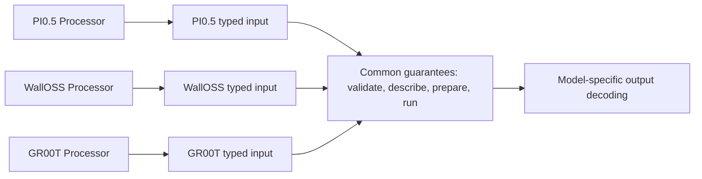
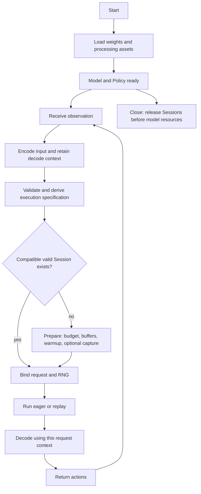
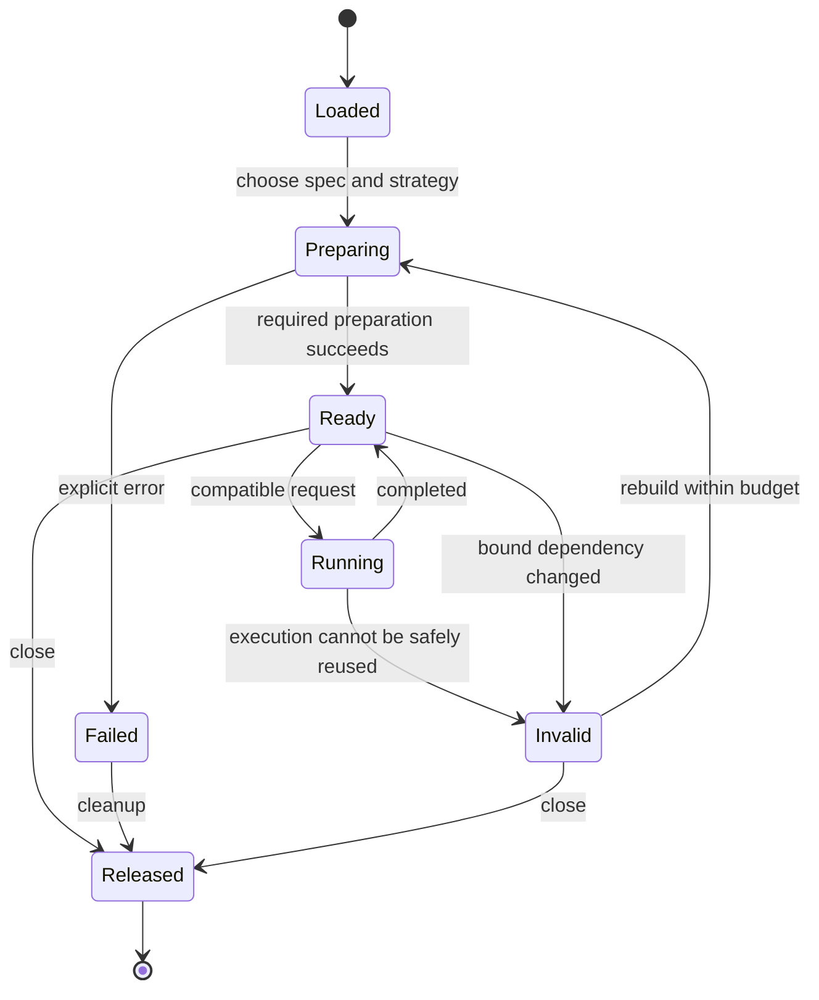
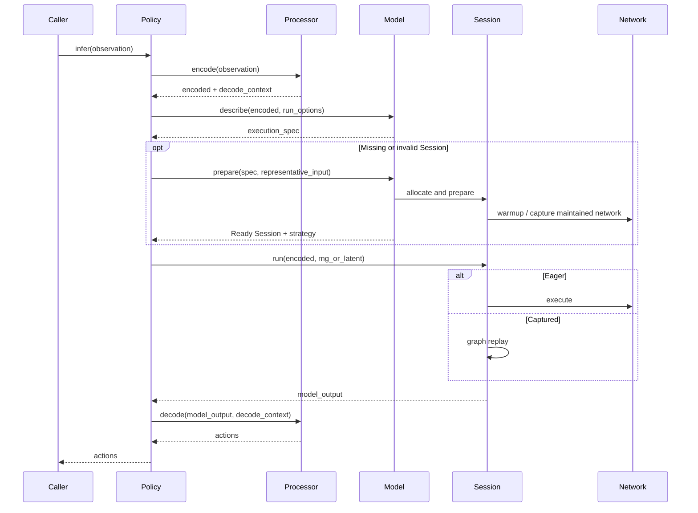

# Model lifecycle: contracts and migration proposal

Status: proposal; interfaces below describe roles, not APIs already implemented.
See [architecture and directory diagrams](architecture.md) for scope and source revisions.

## What is common across three models?

Unify stage guarantees, not internal tokenizer steps or a universal payload.

| Stage | PI0.5 on main | WallOSS on main | GR00T PR #42 |
| --- | --- | --- | --- |
| Language/state encoding | Prompt, optionally discretized state | Discretized state in prompt | NVIDIA processor, continuous state and embodiment |
| Visual input | RGB or preprocessed patches | Patches and visual tokens | Pixel values, grids and attention mask |
| Network | Vision, prefix and action flow | Vision, two experts and solver | Qwen backbone, state/action encoding and DiT |
| Decode | Action denormalization and transforms | Action denormalization and transforms | Official decode with original request state |
| Capture lifecycle | Prepare attempts capture; eager fallback | First run prepares and captures | Dedicated runtime and graph key, whole/split graph code |

A model may need image geometry before assembling prompt tokens. Another may
encode state first. Processor owns this ordering. Session validates the encoded
contract; it does not choose tokenization or state semantics.



## Lifecycle



| Interface role | Input -> output | Required guarantee |
| --- | --- | --- |
| Load | Asset locations and options -> Model and Processor | Weights, config, tokenizer and statistics are compatible; optional calibration is validated only for paths that need it |
| Encode | Observation -> EncodedInput and DecodeContext | Field meaning, units, layout and padding are explicit; context belongs to this request |
| Describe | EncodedInput and execution options -> ExecutionSpec | Captures all allocation, dispatch and capture compatibility conditions |
| Prepare | Spec and representative input when required -> Ready Session | Budget checked, stable resources allocated, required warmup/capture completed; reports eager/captured strategy |
| Run | EncodedInput and RNG/provided latent -> ModelOutput | Validates compatibility and execution dependencies; output device and lifetime are explicit |
| Decode | ModelOutput and DecodeContext -> Actions | Units, coordinates, selected dimensions and request association are correct |
| Reset / Close | Policy or Session state -> reset/released state | Distinguishes history, RNG and cache reset from releasing all resources |

EncodedInput is a role, not a proposal for one optional-field-heavy struct.
Use typed payloads per model and explicit adapters for shared orchestration.
DecodeContext does not pass through the neural network merely to preserve it.
RNG or exact initial latent belongs to run options, separate from the environment
observation. Do not require a host noise tensor when the model supports device RNG.

ExecutionSpec must include more than shape when behavior is bound into a graph.
GR00T's PR key includes pixel shape, image positions and embodiment. WallOSS's
captured latent source mode is currently an additional implicit restriction.
Each implementation must declare whether such values are updateable inputs or
part of plan compatibility. Tactic revisions and device/precision dependencies
must also participate in validity, though they need not be public request fields.

## State and lifetime guarantees



Recoverable request validation errors leave a ready session usable. Capture or
execution failures must specify whether resources are reusable or invalidated.
An eager fallback is an explicit strategy result, subject to caller performance
policy; it must not masquerade as successful graph preparation.

```text
Model lifetime    |---- weights, tokenizer, templates, fixed constants --------|
Session lifetime       |--- spec A: buffers, caches, graph ---|
                                                           |--- spec B -----|
Request lifetime       | encode -> run -> decode |
                              | encode -> run -> decode |
```

- Model owns immutable device weights and fixed constants; Session retains
  references so graph resources cannot outlive the weights they reference.
- Session owns mutable buffers, RNG execution state, caches, and graph resources.
- Session is serial by default; this proposal does not introduce a worker pool
  or claim thread safety for the current unsendable Python handles.
- Fixed schedules and embeddings are computed at the widest valid lifetime,
  not reconstructed for every request when unchanged.
- Report workspace budget per spec. Distinguish reserved arena size, cumulative
  allocation volume and peak live memory; do not silently equate them.
- Cache replacement observes a memory budget; avoid allocating the replacement
  while retaining an obsolete multi-GiB workspace unless the budget permits it.
- ModelOutput declares whether it is owned or a borrowed/reused buffer. A Policy
  must consume/copy it before the Session reuses storage; device output remains
  available without an unconditional host transfer.

## One request: cooperating modules



The public API may remain `policy.infer(observation)`. Explicit preparation is
also useful for deployment and benchmarking, but callers should not need to
manually orchestrate these internal stages for ordinary inference.

## Migration slices and acceptance

Do not begin with a directory-wide rename or create one file per lifecycle stage.
First characterize behavior, separate mathematical ownership from execution
state inside existing model implementations, and only then extract demonstrated
common mechanisms. Policy encode/decode helpers may stay in the existing file.


This draft changes documentation only. It does not claim implementation LOC,
GPU correctness, or latency results. The following slices describe expected code
scope; estimate actual diff size after each bounded implementation is prepared.

| Slice | Expected scope | Acceptance evidence |
| --- | --- | --- |
| 1. Contract characterization | Existing policies, native inputs, public-path tests | Record each model's shape, dtype, decode context, reset and output-lifetime behavior |
| 2. Policy and processor separation | Existing Python policy files and thin bindings | Same raw observations yield equivalent encoded inputs and decoded actions; preserve imports |
| 3. Network extraction | PI0.5/WallOSS runtimes; GR00T after coordination with PR #42 | Reference checkpoints and exact-input eager results remain within declared tolerances |
| 4. Session lifecycle | Model session implementations and proven shared helpers | Prepare/replay parity, invalidation, latent-mode changes, failure cleanup and memory-budget checks |
| 5. Common registration and backbone seam | Loaders, bindings, reviewed Qwen3-VL reuse | All three have maintained loading/serving paths; no dependency-check bypass without reviewed interface |
| 6. Qualification | Requested hardware and precision paths | Raw observation-to-action checks, eager/captured parity, latency and memory compared with baseline |

GR00T is a separate open PR. Do not merge it into this branch or rewrite its
implementation merely to complete these documents. Coordinate the contract and
backbone decisions before rebasing or implementing its migration.

Calibrated PI0.5/GR00T paths and dynamic FP8 WallOSS need different quantization
behavior. Common loading validates declared capabilities; it must not force
static calibration on every FP8 model. Keep numerical tolerances and performance
budgets explicit per supported target/precision tuple.

## Deliberately outside this proposal

- A universal graph IR, processor DSL, model inheritance tree or mandatory
  dynamic dispatch in kernel hot paths.
- Moving all preprocessing to CPU, or moving prompt semantics into Session.
- Making every model use identical input fields, schedule, precision strategy
  or CUDA capture topology.
- Rewriting LLM/VLM generation before the VLA lifecycle contracts are validated.
- Automatically publishing private port evidence or project workflow artifacts.
