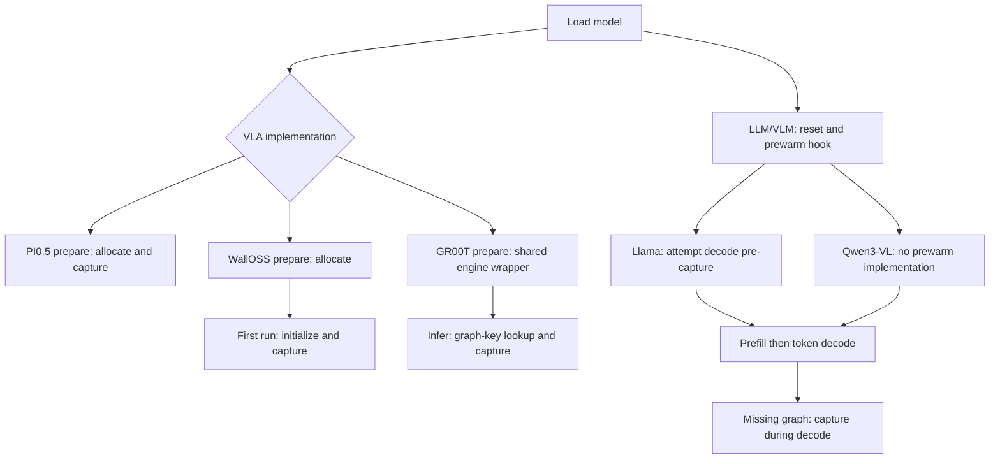
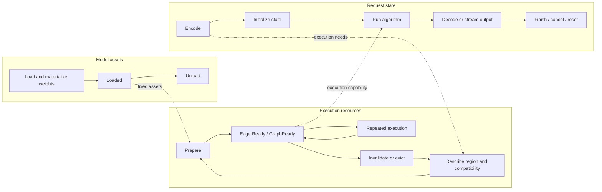
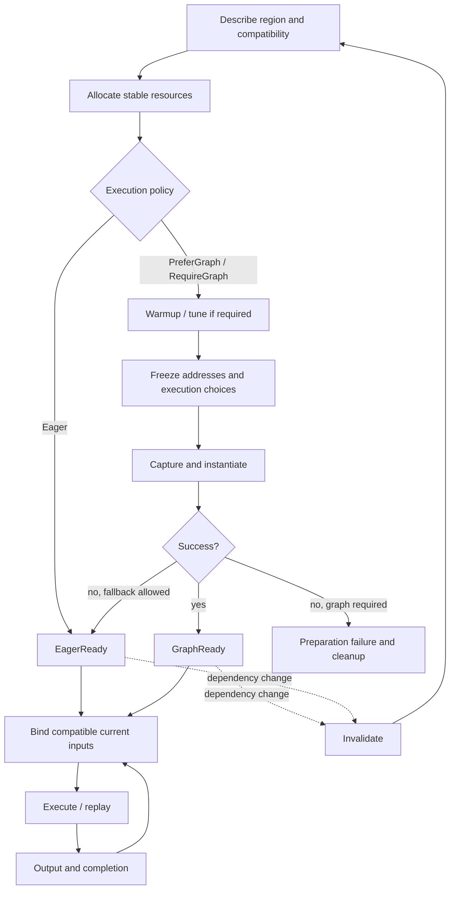

# Model lifecycle contracts

Status: target specification, not implemented APIs. Current-source baseline and
module responsibilities are in [architecture.md](architecture.md).
Implementation order and tracking are in [migration.md](migration.md).

## Current lifecycle differences at upstream/main 7baa69b

| Family | Preparation and capture | State / output observations |
| --- | --- | --- |
| PI0.5 | Explicit prepare allocates and attempts capture, with eager fallback; automatic infer may tune on a real request first | Prepared plan owns resources; tuning-generation checks; device Action |
| WallOSS | prepare allocates; first run initializes and captures; explicit no-graph path; capture errors otherwise propagate | Private input/noise-mode constraints; device Action |
| GR00T | prepare returns a wrapper sharing engine; infer checks private graph key and captures on demand, with eager fallback | Engine owns graph; explicit noise required; Action already on CPU |
| Llama | Shared generation resets state, attempts decode prewarm, then prefill/decode | Actual decode implementation uses one capacity-bound graph; lazy capture still possible |
| Qwen3-VL | Shared generation; prewarm hook is default no-op; decode captures on new KV-length bucket | Image processing in prefill; KV and rope delta reset; power-of-two decode buckets |

VLA public InferenceSpec currently contains only token_count and image_layout;
private model constraints are richer. Generic Action device-residency comments
are not matched by GR00T's current host-return behavior. These are migration
inputs, not claims that numerical results are incorrect.



## Three lifetimes



KV storage is reusable; its valid content/length belongs to a generation.
Latent storage is reusable; latent values belong to an inference. Request reset
is not plan eviction or model unload. Conversation/episode state, when needed,
has an explicit owner and reset scope; it is not inferred from a socket closing.
Sessions are serial by default, not implicitly thread-safe or concurrent.

## Preparation and CUDA Graph contract

Prepare establishes readiness for an execution region and compatible input range,
not one boolean for an entire model. Load normally performs checkpoint parsing,
weight packing/quantization and upload. Processor encodes user input. Prepare
ensures execution resources and choices are ready; already available work is reused.
Calibration profiles are loaded/validated assets, not collected on every prepare.



Required invariants:

- Ready means the selected region will not secretly allocate new capacity, tune
  or capture inside execute. A convenient infer/generate may call ensure_prepared.
- Unknown decode ranges may cause an explicit preparation transition mid-request;
  predictable ranges may be prewarmed. Report preparation separately from execution.
- A whole VLA loop, a decode step, or a smaller supported region may be captured.
  Stage uniformity does not require identical graph topology or graph count.
- Warmup/tuning uses isolated or safely restored state. It must not consume the
  real request RNG sequence, advance KV state or denoising steps. Extending a plan
  during generation must preserve the active request, not reset it.
- Plan validity covers actual bound shape/layout, capacity, model/weight identity,
  device, precision and tuning dependencies. Ordinary data updates should use
  stable buffers, not unnecessarily enter the cache key.
- PreferGraph fallback is observable with its reason; RequireGraph fails on
  capture failure. Failed capture cleans up handles/resources and declares reuse.
- Invalid requests do not automatically destroy an otherwise healthy plan.

Graph storage is an in-process executable handle, not checkpoint serialization.
Current backend wrappers retain graph/exec handles and destroy them on drop.
The owning plan must keep every referenced buffer, workspace, weight and device
context alive. Graph handles alone do not own all user memory they reference.

```rust
// Pseudocode: ownership can be shared rather than duplicated per plan.
struct PreparedPlan {
    compatibility: PlanKey,
    mode: EagerOrGraph,
    inputs_outputs: StableBuffers,
    workspace: Workspace,
    resources: RetainedDependencies, // model/state storage/context references
}
struct Session {
    model: SharedModel,
    plans: BoundedPlanCache,
    state_storage: StateStorage,
    request_state: RequestState,
}
```

Session decides budgets and lifetime; backend supplies allocator/graph mechanisms.
Reuse existing GraphWorkspace initially rather than introducing a second allocator.
Current GR00T and WallOSS reservations are 4 GiB and 12 GiB respectively, not
intrinsic graph requirements. Report reserved, cumulative allocated and peak live
bytes separately. Replacement must respect total budget and wait for safe resource
release. Writable fixed-buffer plans cannot be concurrently reused without isolation.

## Interfaces and module interaction

| Role | Conceptual interface | Contract |
| --- | --- | --- |
| Model | load(options); create_session(limits, policy) | Fixed assets and declared capabilities; no implicit request state sharing |
| Processor | encode(raw) -> typed input + output context | Model-specific semantics, validated layout/units and per-request context |
| Network | describe(region, input, options); compute(region, state_view, ctx) | Execution needs and tensor computation; no plan eviction or prompt interpretation |
| Session | prepare(input, options) -> ReadyReport | Per-region mode, preparation work and fallback reason |
| Session | infer / generate_stream | Native algorithm execution using compatible resources |
| Driver | generate / infer_action | Sampling, EOS and algorithm iteration/update rules |
| Processor | decode(output, context) | Final actions or incremental text; preserve request association |
| Session | reset_request; clear_plans; close/drop | Separate semantic reset, cache eviction and resource release |

These roles do not mandate one universal trait or optional-field-heavy input bag.
VLA action inference and LLM/VLM generation retain distinct public capabilities.
Initial noise or RNG is a run option, not an environment observation field.

```mermaid
sequenceDiagram
    participant U as Caller
    participant F as Policy / TextModel
    participant P as Processor
    participant S as Session
    participant D as Native algorithm
    participant N as Network / Blocks
    participant B as Backend
    U->>F: infer / generate
    F->>P: encode
    P-->>F: typed input + context
    F->>S: prepare(input, options)
    S->>N: describe regions
    S->>B: allocate; optional warmup/capture
    S-->>F: ReadyReport
    F->>S: infer / generate_stream
    S->>D: run algorithm
    loop Required computation
        D->>S: execute region
        alt Eager
            S->>N: tensor computation
            N->>B: kernels
        else Captured
            S->>B: bind and replay
        end
        S-->>D: device result
        D->>D: sample / update / stop
    end
    D-->>F: output or events
    F->>P: decode(output, context)
    P-->>U: actions or text
```

```rust
fn generate(session, prompt, options, emit) {
    session.reset_request();
    sampler.begin(options);
    logits = session.execute(Prefill, prompt);
    for index in 0..options.max_new_tokens {
        token = sampler.sample(logits);
        emit(token);
        if is_eos(token) || index + 1 == options.max_new_tokens { break; }
        session.ensure_decode_ready(next_position); // explicit if needed
        logits = session.execute(Decode, token);
    }
}
// VLM changes prefill (vision + feature merge), not the per-token generation loop.
fn flow_inference(input, options) {
    condition = network.encode_condition(input);
    latent = initialize_latent(options.noise);
    for time in schedule {
        velocity = network.predict_velocity(condition, latent, time);
        latent = solver.update(latent, velocity, time);
    }
    return latent;
}
// A fixed flow body may be captured as one region; no host step loop is required.
```

ModelOutput specifies device, completion ordering and ownership. Device results
must remain available without an unconditional host transfer. A borrowed output
must state when the next run overwrites it; the facade consumes or copies before
reuse. Cross-stream or host consumption observes completion. DecodeContext stays
outside Network; LLM incremental detokenization may retain request-local state.

## Verification contract

Every migrated model/precision declares accepted inputs, exact-noise/seed behavior,
output tolerances and supported hardware. Verify public raw-input paths, eager vs
graph parity, state reset, graph reuse/invalidation, fallback/cleanup, cancellation
and output lifetime as applicable. Measure cold preparation, steady-state latency,
LLM TTFT/TPOT, and device memory separately. A documentation or CPU check does not
qualify native GPU execution; unsupported or untested matrix cells remain explicit.
