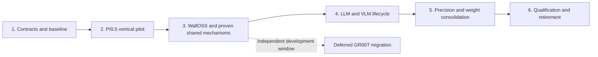

# Model lifecycle refactor: staged rollout and documentation gates

Status: staged implementation in progress. No implementation stage is complete.
Architecture and interface decisions live in [architecture.md](architecture.md)
and [lifecycle.md](lifecycle.md); this file owns rollout order and evidence tracking.
Current-source review baseline: upstream/main
`7baa69b281ef862e6afa32c476c58143d3964241`.

## Rollout principles

Use one model as a vertical pilot before extracting a shared framework. A stage
may span several small reviewable PRs; do not equate a stage with one large diff.
Each production change is qualified on its supported paths before migration moves
on. Final qualification consolidates evidence; it is not the first time GPU
correctness or performance is checked. Preserve public entry points unless a
reviewed compatibility change requires otherwise.

Do not begin with directory-wide executor renames, three new dtype trees, a
universal Network factory, a graph IR, or a new allocator. Do not combine a kernel
algorithm optimization with structural migration unless the separation is
impossible and the numerical/performance change is explicitly reviewed.

## Stage 1: contracts and reproducible baseline

Deliverables:

- Refresh the implementation worktree against the selected main revision before
  coding. Resolve newer changes explicitly; this documentation refresh does not
  claim the old refactor worktree already contains merged GR00T.
- Record current entry points, input contracts, preparation modes, request state,
  output residency, graph keys and memory ownership for PI0.5, WallOSS, GR00T,
  Llama and Qwen3-VL. Use the two specification documents as the starting point.
- Record a supported model/checkpoint/device/precision matrix. Agree numerical
  tolerances and performance budgets before changing code, not after regressions.
- Establish reusable raw-input, exact-latent and generation fixtures. Keep private
  checkpoints/datasets in place; record paths and revisions in devlocal evidence.
- Inventory consumers of existing weight/compute types before moving shared code.

Stage 2 may proceed in an isolated candidate while Stage 1 runs on Thor, as
requested. Keep baseline source and artifacts immutable; compare the candidate
against that baseline before accepting the slice. Prefer verified existing
operator libraries; compiling Rust model code does not authorize a CUDA operator
rebuild. Concurrent GPU loads invalidate formal latency comparisons.

Exit: baseline commands and results are reproducible on selected hardware; every
matrix cell is qualified, explicitly pending, or unsupported. Unavailable GPU
access blocks GPU qualification, not documentation or local structural work.
Current status: source merge and inventory complete; local checks recorded in
[Stage 1 baseline protocol](baseline.md). Thor BF16 slice parity passes; remaining
GPU matrix cells, target assets and missing budgets remain pending. Stage 1 is not complete.

## Stage 2: PI0.5 vertical pilot

Why PI0.5: it already attempts capture during explicit prepare, supports eager
fallback and checks tuning-generation validity. These provide a concrete starting
point for the target readiness contract without overlapping active GR00T work.

Deliverables:

- Separate fixed assets, Network/Blocks and Session ownership inside PI0.5.
  Begin with major vision/language/action computations, not a directory-wide rename.
- Use BF16 as the first evidence path while preserving FP8/W8A8 behavior. Verify
  every affected supported precision before shipping shared changes; broad weight
  and precision consolidation remains Stage 5.
- Preserve tuning-generation validity, generated/provided noise behavior, input
  compatibility and eager fallback while making their guarantees explicit.
- Implement explicit prepare readiness, captured-resource retention, output
  device/lifetime contracts, and request reset versus plan invalidation.
- Keep processor encode/decode context explicit in existing Policy helpers.
- Provide a native raw-input-to-output vertical path and regression evidence.

Exit: a compatible run performs no hidden capture/tuning; changed compatibility
enters explicit preparation; capture failure and cleanup obey policy. Exact-input
results and public action decoding meet declared tolerances and resource/latency
budgets. Network has no cache/serving logic; Session has no duplicate network body.

### Stage 2 slice A: BF16 computation ownership

The first candidate extracts 14 computation/diagnostic methods from
pi05/bf16_runtime.rs into pi05/network.rs. The BF16 runtime owns capture, input
updates and workspace lifetime and delegates eager/captured math to the same
Network. Captured objects retain an Arc to Network, keeping referenced weights
alive. Existing public methods and Bf16PrefixKvCache export remain compatible.

This slice deliberately leaves preparation semantics and FP8/W8A8 computation
unchanged. It is not the final precision-neutral Network or full Stage 2 result.
The current *_executor files remain the Block implementations until subsequent
semantic grouping is justified. Next slices address the VLA prepared-session
interface and remaining precision paths with their own validation.

Validation so far: CUDA-feature Rust typecheck including all examples passes on
macOS without linking CUDA; all 14 moved method bodies match baseline ignoring
formatting; family dependency check passes. Thor native AutoModel smoke passes
for baseline and candidate. All four two-view H10/H50 × T10/T21 cases show exact
baseline/candidate and eager/graph parity (max_abs=0, relative L2=0, cosine=1).
See [baseline evidence and limits](baseline.md#thor-bf16-slice-a-numerical-result-2026-09-15).
Performance and full matrix qualification remain open. No operator source changed.

### Stage 2 slice B: explicit PI0.5 Session preparation

Implemented: `session.rs` replaces `vla_runtime.rs`, with `Pi05Session` and a
compatible `Pi05VlaRuntime` alias. LoadedModel and VlaRuntime expose
prepare_with_policy, prepare_for and clear_prepared. PreparedInference reports
actual mode, fallback reason and invalidation. Eager/PreferGraph/RequireGraph
have distinct behavior; prepared run suppresses autotuning and rejects stale
plans for both eager and graph. Real-input tuning stays in preparation or the
legacy infer cache-miss path. Old implicit plans are released before replacement
tuning allocations. Explicitly held plans are not silently destroyed.

See [the callable lifecycle contract](lifecycle.md#implemented-pi05-preparation-contract-stage-2-slice-b)
for output aliasing and remaining limitations. Host-side tuning suppression is
scoped and unwind-safe; operator sources and build flags are unchanged.

Validation: local CUDA-feature examples/tests typecheck; macOS native test
linking is unavailable without CUDA. Thor BF16/FP8 native policy and parity
qualification is in progress. W8A8/Orin, forced native capture-failure cleanup,
full resource/performance gates and later Stage 2 slices remain open.

## Stage 3: WallOSS; extract proven common mechanisms

Deliverables:

- Use WallOSS as the second implementation to test which PI0.5 mechanisms are
  actually shared, rather than exporting PI0.5-specific assumptions as a framework.
- Make first-run initialization/capture an explicit preparation transition;
  retain or explicitly expose vision and latent-source compatibility conditions.
- Preserve dynamic FP8 behavior; do not impose PI0.5 static-calibration assumptions.
- Extract only mechanisms demonstrated by both migrated callers: capture cleanup,
  readiness reporting, bounded caching or resource retention. Keep model-specific
  layouts and semantic graph keys local.
- Keep Policy imports and generic binding entry points usable. Shared-contract
  changes must remain compatible with unmigrated GR00T through existing interfaces
  or a narrow migration adapter; do not silently change its behavior.

Exit: PI0.5 and WallOSS follow the same phase guarantees with explicit
model-specific payloads and graph topology. Test shape/mode changes, repeated
requests, noise/reset, fallback and memory-budget replacement on affected targets.
No broad cross-model backbone extraction is required for this stage.

## Deferred GR00T migration: independent development window

GR00T has concurrent feature development. Do not modify its Network, weights,
executor or capture path as part of the initial PI0.5/WallOSS migration. Its richer
inputs and resource ownership remain design constraints, not a reason to block
progress or to invent a universal contract in advance.

After an appropriate development window is agreed, re-audit the then-current
GR00T implementation and migrate it in separate PRs using the contracts validated
by PI0.5 and WallOSS. Preserve its existing precision-parameterized computation,
private backbone and request-local decode context. Do not assume today's file
layout or graph behavior will still apply.

This work does not block Stages 4 and 5 for other models. Stage 6 may qualify the
migrated subset, but must retain compatible legacy paths and mark GR00T pending;
framework-wide completion and removal of GR00T compatibility code require its
migration and affected GPU qualification to finish.

## Stage 4: LLM and VLM execution lifecycle

Deliverables:

- Preserve the shared native sampling/EOS generation driver and VLM prefill hook.
- Separate reusable KV storage/graphs from request valid length, positions and
  sampler state. New generation reset must not unnecessarily discard graph plans.
- Represent Llama prewarm and Qwen3-VL bucket capture through explicit preparation
  transitions. Prepare predictable decode ranges; preserve active state when
  extending an unforeseen range mid-generation.
- Document tokenizer/template and VLM input-processing ownership. Reuse existing
  tokenizer code; do not mandate a new Processor wrapper for already encoded input.
- Keep text generation and action inference interfaces distinct; reuse lifecycle
  mechanisms only where their contracts genuinely match.

Exit: multi-token and multimodal prefill/decode correctness, reset, EOS/limits,
streaming/cancellation and bucket transitions pass. Measure preparation, TTFT and
TPOT separately; no per-token Python control or new per-layer dynamic dispatch.

## Stage 5: precision and weight consolidation

Deliverables:

- Consolidate duplicate model weight trees and checkpoint mapping where structure
  matches; retain independent precision storage/scales/layouts where required.
- Group specialized compute beneath semantic blocks, e.g. blocks/action/fp8.rs.
  Do not create complete parallel networks under blocks/<dtype>/.
- Move matrix representations/packing to shared code only after multiple maintained
  callers demonstrate a compatible contract; kernel weight views stay backend-owned.
- Keep model-specific quantization choices in construction and scales/calibration
  site mapping explicit. Preserve mixed precision and fused quantization paths.
- Put maintained independent reference paths in a dedicated parity/benchmark
  harness. Temporary probes remain in devlocal, not alternate production Networks.

Exit: a supported precision can be selected without copying Network or lifecycle
logic. Check every affected precision with its checkpoint/calibration assets;
measure fusion, conversion overhead, memory and latency. Do not replace production
specialization with a universal optional-method trait solely to reduce lines.
Small Block moves needed by earlier stages are allowed; broad consolidation waits
until resource ownership and lifecycle have been exercised.

## Stage 6: end-to-end qualification and retirement

Deliverables:

- Consolidate supported-device/precision evidence; explicitly identify gaps.
- Check public callers, raw processing, device output, repeated requests, resource
  eviction, cancellation/error cleanup and model unload.
- Remove obsolete executor/runtime wrappers and duplicate production paths only
  after their callers and supported behaviors have migrated.
- Update current architecture references, model-port instructions, examples and
  API documentation. Mark which target contracts are implemented per model.
- Review locality: processor change, FFN fusion, backbone replacement, topology
  change and graph policy each have a predictable owner.

Exit: supported matrix passes agreed budgets, deprecated paths have a deliberate
compatibility decision, and maintained docs describe shipped behavior. File-count
or LOC reduction alone is not an acceptance metric.

## Documentation and review protocol

Each code PR changing a seam must update its relevant documentation in that same
PR. A separate documentation follow-up is not the default completion criterion.

| Changed subject | Source of truth to update |
| --- | --- |
| Ownership, Network/Block cut, dtype layout | architecture.md plus affected module rustdoc |
| prepare/run/reset, graph validity, output lifetime | lifecycle.md plus public/interface docs |
| Stage progress and supported evidence | This file's tracker; private evidence linked by reproducible location/revision |
| Current implementation guidance | ../model-layer-architecture.md and related maintained model guide |
| New model implementation checklist | ../../skills/model-port-workflow/SKILL.md and ../adding-a-new-model.md |
| User-visible behavior | Binding/facade documentation and examples |

The port skill now links the callable PI0.5 preparation contract and requires
family-specific evidence before declaring support. Preserve native GPU verification
requirements and distinguish implemented guarantees from the broader target.

Every implementation review includes:

1. Before/after ownership and any changed interface guarantee.
2. Current and target status, including compatibility or migration adapters.
3. Affected model/device/precision matrix and actual validation evidence.
4. First-use versus steady-state latency and relevant memory evidence.
5. Updated diagrams/rustdoc and no contradictory old-current descriptions.
6. Declared exceptions with rationale, owner/location and removal condition.

Keep invariants next to their code as well as in this specification: a prepared
plan's retained resources, output overwrite rules and Block physical layouts must
be discoverable without rereading conversation history. Do not copy long prose
into every file; link to the maintained contract and document local exceptions.

## Implementation tracker

Implementation and validation are tracked separately. No stage may be marked done
solely because the documentation or a CPU build passes.

| Scope | Contract / resource migration | GPU parity and budgets | Documentation promotion |
| --- | --- | --- | --- |
| Baseline matrix | Source merge and inventory complete | Thor BF16 subset passed; remaining matrix pending | baseline.md added |
| GR00T | Deferred: concurrent development | Pending | Target specified; re-audit before migration |
| PI0.5 | Slices A/B: BF16 Network and explicit Session policy | A: Thor parity passed; B: native verification in progress | Callable interfaces and limits recorded |
| WallOSS | Pending | Pending | Target specified |
| Llama | Pending | Pending | Target specified |
| Qwen3-VL | Pending | Pending | Target specified |
| Precision/weight consolidation | Pending | Pending | Target specified |

Record intermediate logs, profiling and experiment code under the active worktree's
ignored devlocal/model-lifecycle-refactor/ directory. Formal contracts and reusable
harnesses stay in maintained locations. Do not force-add private intermediate data.
