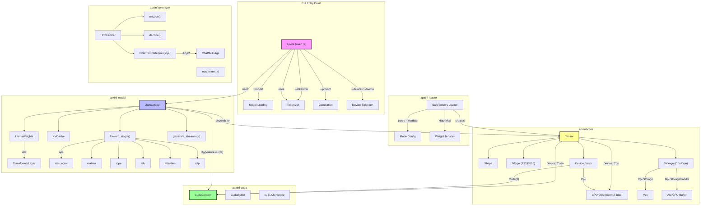

# ApxInf LLM Inference Engine - System Design



## Crate Structure

| Crate | Purpose | Key Components |
|-------|---------|----------------|
| `apxinf` | CLI entry point | argparse, generation loop, streaming output |
| `apxinf-core` | Core tensor infrastructure | Tensor, Shape, DType, Storage, Device enum |
| `apxinf-cuda` | CUDA GPU backend | CudaContext, CudaBuffer, cuBLAS and custom kernels |
| `apxinf-loader` | Model weight loading | SafeTensors parser, ModelConfig |
| `apxinf-model` | Model architecture | LlamaModel, TransformerLayer, KVCache, forward pass |
| `apxinf-tokenizer` | Text encoding/decoding | HfTokenizer wrapper, chat template support |

## Data Flow

1. **Loading**: SafeTensors → HashMap<String, Tensor> → LlamaModel
2. **Device Transfer**: CPU Tensor → CUDA Tensor
3. **Forward Pass**:
   - Embedding lookup → [1, hidden_size]
   - For each layer: RMSNorm → Attention → Residual → RMSNorm → MLP → Residual
   - Final RMSNorm → Output projection → [1, vocab_size]
4. **Generation**: argmax(logits) → token_id → decode → text

## GPU Backend Dispatch

```rust
match device {
    Device::Cpu => cpu_op(...),
    Device::Cuda(_) => cuda_op(...),
}
```
